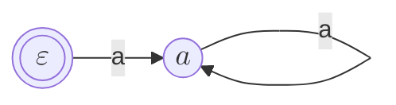
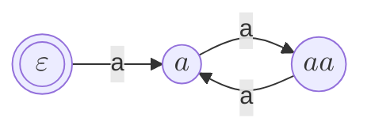
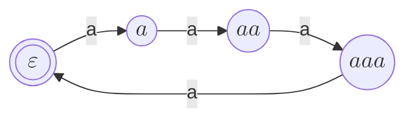
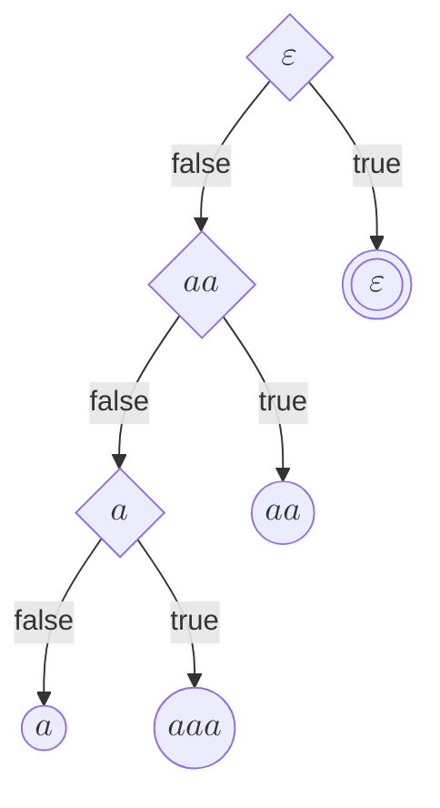
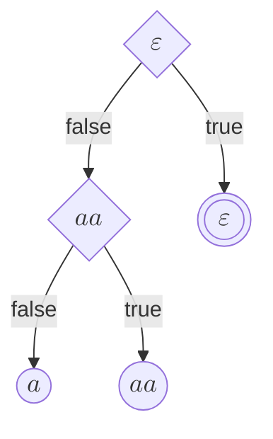
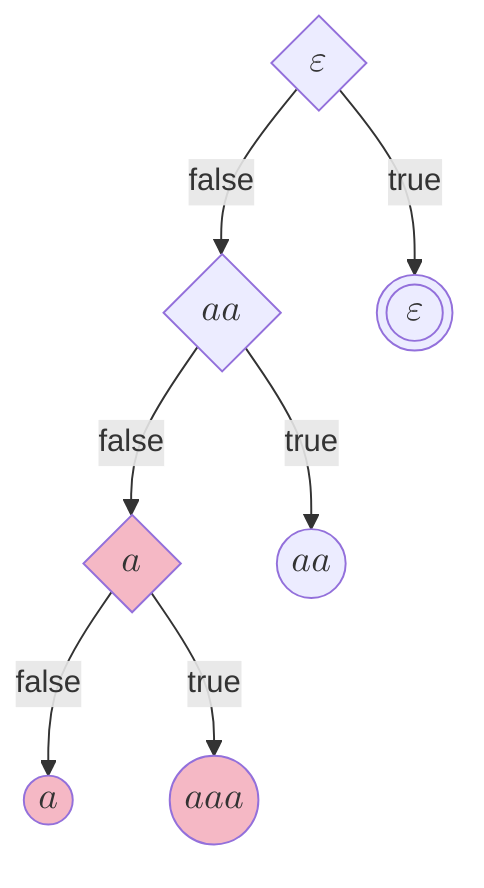

Angluinの $$L^\ast$$ はオートマトン学習 (automata learning) のアルゴリズムとして最も有名なものです。
以前、このブログでも[Angluinの $$L^\ast$$ について説明](https://makenowjust-labs.github.io/blog/post/2023-07-19-lstar/)しました。

$$L^\ast$$ は歴史のあるアルゴリズムのため、派生アルゴリズムがいくつか存在します。
この記事ではAngluinの $$L^\ast$$ について簡単に説明した上で、派生アルゴリズムとして**Rivest-Schapire**と**Kearns-Vazirani**を紹介します。

- **Rivest-Schapire**は $$L^\ast$$ の反例 (counterexample) の解析手法の提案で、二分探索を用いて反例の中のobservation tableに追加すべき接頭辞を探すことで、計算量を改善します。
- **Kearns-Vazirani**はobservation tableを置き換えるデータ構造として*discrimination tree*というデータ構造を提案するものです。

これらの手法により $$L^\ast$$ の様々な効率が改善できます。

**想定読者**: オートマトン理論やオートマトン学習について理解・関心がある。

{/* read more */}

import Alert from "@/components/daisyui/Alert";

# 準備

真偽値とは $$\mathbf{true}, \mathbf{false}$$ のことで、この2つからなる集合を $$\mathbb{B} = \{ \mathbf{true}, \mathbf{false} \}$$ で表します。

$$\Sigma$$ をアルファベットとして固定し、その元を文字と呼びます。
文字を1列に並べたものを文字列と呼び、空文字列を $$\varepsilon$$ で表します。
文字列全体からなる集合を $$\Sigma^\ast$$ で表します。
2つの文字列 $$w_1, w_2 \in \Sigma^\ast$$ の結合を $$s_1 \cdot s_2$$ で表しますが、単に $$s_1 s_2$$ と表すこともあります。

<Alert color="success">
  **定義 (DFA)**:
  決定性有限状態オートマトン (DFA) $$\mathcal{A}$$ とは4つ組 $$\mathcal{A} = (Q, q_0, F, \delta)$$ で、それぞれ

  - $$Q$$ は有限の状態集合、
  - $$q_0 \in Q$$ は初期状態、$$F \subseteq F$$ は受理状態の集合、
  - $$\delta\colon Q \times \Sigma  \to Q$$ は遷移関数を意味します。
</Alert>

遷移関数 $$\delta$$ は $$\delta(q, \varepsilon) = q,\,\delta(q, \sigma w) = \delta(\delta(q, \sigma), w)$$ として文字列に拡張されます。
DFA $$\mathcal{A}$$ の出力関数 $$\gamma\colon Q \times \Sigma^\ast \to \mathbb{B}$$ は $$\delta(q_0, w) \in F$$ のとき $$\mathbf{true}$$、$$\delta(q_0, w) \notin F$$ のとき $$\mathbf{false}$$ を返す関数とします。

# Angluinの $$L^\ast$$

まず始めに、[Angluin](https://en.wikipedia.org/wiki/Dana_Angluin)の $$L^\ast$$ について簡単に説明します。

Angluinの $$L^\ast$$ は[\[Angluin, 1987\]](#ref-angluin-1987)で提案されたオートマトン学習 (automata learning) のアルゴリズムです。

$$L^\ast$$ は、学習対象の (正規) 言語について、次の2つのクエリーに応答できる _MAT_ (_minimally adequate teacher_) と呼ばれる教師を与えることで、言語をDFAとして学習します。

- $$\mathrm{MEMBER}(w)$$ (_membership query_): $$w$$ が学習対象の言語に含まれるかどうかを真偽値で返す。
- $$\mathrm{EQUIV}(\mathcal{H})$$ (_equivalence query_): 学習中の仮説 (hypothesis) のオートマトン $$\mathcal{H}$$ が学習対象の言語に等しいか判定する。等しい場合 $$\mathbf{true}$$ を返し、異なる場合はその反例となる文字列 (一方に含まれて一方に含まれないような文字列) を返す。

## observation table

$$L^\ast$$ の重要なデータ構造である*observation table*と、*consistency*と*closedness*という概念について説明します。

<Alert color="success">
  **定義 (observation table)**: *observation table*は3つ組 $$(S, E, T)$$ のことで、それぞれ次のような値となります。

  - $$S$$ は*prefix-closed*な接頭辞の集合で、$$E$$ は接尾辞の集合です。$$S$$ が*prefix-closed*とは、文字列 $$s = \sigma_1 \sigma_2 \cdots \sigma_n$$ が $$S$$ に含まれているとき、$$s$$ の接頭辞 $$\varepsilon,\,\sigma_1,\,\sigma_1 \sigma_2,\,\cdots,\,s$$ がすべて $$S$$ に含まれることを意味します[^e-suffix]。
  - $$T$$ は $$(S \cup (S \cdot \Sigma)) \cdot E \to \mathbb{B}$$ の関数で、 $$T(s \cdot e) = \mathrm{MEMBER}(s \cdot e)$$ となるように更新されます。
</Alert>

[^e-suffix]: Angluinの論文では $$E$$ もsuffix-closedとしていますが、説明上の都合から今回は含めていません。

補助的な関数として $$\mathrm{row}\colon (S \cup (S \cdot \Sigma)) \to \mathbb{B}^E$$ を次のように定義します。

$$
\mathrm{row}(s) = e \mapsto T(s \cdot e)
$$

ここで $$e \mapsto F(e)$$ は $$e$$ を引数とする関数を表します。

各 $$s \in S$$ に対する $$\mathrm{row}(s)$$ の値が、仮説 (対応するDFA) での状態に相当します。

observation tableは次の*consistency*と*closedness*という制約を満たしているとき、仮説 (対応するDFA) を考えることができます。

<Alert color="success">
  **定義 (consistency)**:
  「observation table $$(S, E, T)$$ が*consistent*である」とは、$$s_1, s_2 \in S$$ が $$\mathrm{row}(s_1) = \mathrm{row}(s_2)$$ のとき、すべての $$\sigma \in \Sigma$$ について $$\mathrm{row}(s_1 \cdot \sigma) = \mathrm{row}(s_2 \cdot \sigma)$$ であることを表します。
</Alert>

<Alert color="success">
  **定義 (closedness)**:
  「observation table $$(S, E, T)$$ が*closed*である」とは、$$s \in S$$ と $$\sigma \in \Sigma$$ について $$\mathrm{row}(s \cdot \sigma) = \mathrm{row}(t)$$ となる $$t \in S$$ が存在することを表します。
</Alert>

つまり、

- *consistency*は、$$\mathrm{row}(s_1) = \mathrm{row}(s_2)$$ なら2つの接頭辞 $$s_1, s_2 \in S$$ が表す状態は同じはずだが、1文字遷移した先が異なる、といった変な状態にはならない、ということを意味し、
- *closedness*は、$$s$$ の遷移先に対応する接頭辞が $$S$$ に存在せず遷移できない、ということが起こらないことを意味します。

observation tableがconsistentかつclosedであるとき、対応する仮説 (hypothesis) のDFAが考えられます。

<Alert color="success">
  **定義 (hypothesis)**: *consistent* かつ *closed* である observation table $$(S, E, T)$$ に対応する**仮説** (*hypothesis*) のDFA $$\mathcal{H} = (Q, q_0, F, \delta)$$ は次のように定義されます。

  - 状態の集合 $$Q = \{ \mathrm{row}(s) \mid s \in S \}$$、
  - 初期状態 $$q_0 = \mathrm{row}(\varepsilon)$$、
  - 受理状態の集合 $$F = \{ \mathrm{row}(s) \mid s \in S \land T(s) = \mathbf{true} \}$$、
  - 遷移関数 $$\delta(\mathrm{row}(s), \sigma) = \mathrm{row}(s \cdot \sigma)$$。
</Alert>

<Alert color="warning">
  **注意**: closedなため遷移関数 $$\delta$$
  の遷移先は正しく定義されます。また、consistentなので $$\mathrm{row}(s)$$
  の値が同じ接頭辞 $$s \in S$$
  が複数ある場合に、どれを選んでも同値なDFAになります。
</Alert>

<Alert color="error">
  **疑問1**: $$s \in S$$ と $$e \in E$$ のすべての組み合せが $$T$$
  に追加されていますが、区別するためには共通するものは省略できそうに思えます。この直観を実現するには、どのようなデータ構造が効率的でしょうか？
</Alert>

## アルゴリズム

observation tableをconsistentかつclosedになるように更新して仮説 $$\mathcal{H}$$ を構築し、equivalence queryを投げて、返ってきた反例でobservation tableを修正する、ということを繰り返すのが $$L^\ast$$ の実際の流れになります。

[\[Angluin, 1987\]](#ref-angluin-1987)の§2.2には疑似コードが掲載されています。
下のAlgorithm 1 (<span className="katex-ps-funcname">Angluin</span>) は、その疑似コードをより具体的に書き直したものになります。

```pseudocode
\begin{algorithm}
  \caption{Angluin's $L^\ast$}
  \begin{algorithmic}
    \FUNCTION{Angluin}{$\mathrm{MEMBER}, \mathrm{EQUIV}$}
      \STATE $S, E \gets \{ \varepsilon \}$
      \STATE $T(t) \gets \mathrm{MEMBER}(t)$ \textbf{for} each $t \in \{ \varepsilon \} \cup \Sigma$
        \COMMENT{i.e. for each $t \in S \cup (S \cdot \Sigma)$}
      \REPEAT
        \WHILE{$(S, E, T)$ is not consistent or not closed}
          \IF{$(S, E, T)$ is not consistent}
            \STATE Find $s_1, s_2 \in S$, $\sigma \in \Sigma$, and $e \in E$
            \STATE $\quad$\textbf{s.t.} $\mathrm{row}(s_1) = \mathrm{row}(s_2)$ and $T(s_1 \cdot \sigma \cdot e) \ne T(s_2 \cdot \sigma \cdot e)$
            \STATE $E \gets E \cup \{ \sigma \cdot e \}$
            \STATE $T(t \cdot \sigma \cdot e) \gets \mathrm{MEMBER}(t \cdot \sigma \cdot e)$ \textbf{for} each $t \in S \cup (S \cdot \Sigma)$
          \ENDIF
          \IF{$(S, E, T)$ is not closed}
            \STATE Find $s \in S$ and $\sigma \in \Sigma$
            \STATE $\quad$\textbf{s.t.} $\mathrm{row}(s \cdot \sigma) \ne \mathrm{row}(s')$ for all $s' \in S$
            \STATE $S \gets S \cup \{ s \cdot \sigma \}$
            \STATE $T(s \cdot \sigma \cdot d) \gets \mathrm{MEMBER}(s \cdot \sigma \cdot d)$ \textbf{for} each $d \in E \cup (\Sigma \cdot E)$
          \ENDIF
        \ENDWHILE
        \STATE \COMMENT{Now, $(S, E, T)$ is consistet and closed.}
        \STATE Let $\mathcal{H}$ be a hypothesis automaton for $(S, E, T)$
        \IF{$\mathrm{EQUIV}(\mathcal{H}) \ne \mathbf{true}$}
          \STATE Let $P$ be a set of all prefixes of $\mathrm{EQUIV}(\mathcal{H})$
          \STATE $S \gets S \cup P$
          \STATE $T(t \cdot e) \gets \mathrm{MEMBER}(t  \cdot e)$ \textbf{for} each $t \in P \cup (P \cdot \Sigma)$ and $e \in E$
        \ENDIF
      \UNTIL{$\mathrm{EQUIV}(\mathcal{H}) = \mathbf{true}$}
      \RETURN $\mathcal{H}$
    \ENDFUNCTION
  \end{algorithmic}
\end{algorithm}
```

このアルゴリズムは正しく動作し停止します。
まず、一番外側の繰り返しの終了条件から、停止した場合、正しいオートマトンを返すのは明らかです。
そして、学習結果のオートマトンの状態数を $$n$$ とすると、1周毎に新しい $$\mathrm{row}(s)$$ の値が1つは増えていくはずなので、高々 $$n$$ 回の繰り返しで停止するはずです。

次に計算効率として、$$\mathrm{MEMBER}(w)$$ が呼ばれる回数を考えてみます。
$$\mathrm{MEMBER}(w)$$ は $$T$$ の値を更新する際に呼び出されるので、$$T$$ に記録される文字列の個数を数えれば良さそうです。
$$T$$ に記録される文字列は $$(S \cup (S \cdot \Sigma)) \cdot E$$ なので、$$S$$ や $$E$$ がどのように更新されるのかに注目してみます。
ここで、$$\mathrm{EQUIV}(\mathcal{H})$$ の返す反例の長さの最大値を $$m$$、アルファベットの大きさを $$k$$ とします。

- $$S$$ はclosedでない場合に1つ値が追加され、$$\mathrm{EQUIV}(\mathcal{H})$$ は反例を返した場合に反例の接頭辞がすべて追加されます。
  closedでない場合の追加は高々 $$n - 1$$ 回起こり、反例は一度に最大 $$m$$ 個の追加が高々 $$n - 1$$ 回起こります。
  $$S$$ は最初に空文字列で初期化されているので $$+ 1$$ されて、$$|S|$$ は高々 $$n + m (n - 1)$$ と分かります。
- $$E$$ はconsistentでない場合に1つ値が追加され、この追加はclosedでない場合と同様に高々 $$n - 1$$ 回起こります。
  $$|E|$$ も最初に空文字列で初期化されているので、$$|E|$$ は高々 $$n$$ と分かります。

よって、$$|(S \cup (S \cdot \Sigma)) \cdot E|$$ は高々 $$(k + 1) (n + m (n - 1)) n = O(k n^2 m)$$ となります。

<Alert color="error">
  **疑問2**: 反例に対してすべての接頭辞を $$S$$
  に追加していますが、これは本当に必要なのでしょうか？
  また、どうしてconsistentでない状況が発生してしまうのでしょうか？
</Alert>

# Rivest-Schapire

**Rivest-Schapire**は1993年に[Rivest](https://en.wikipedia.org/wiki/Ron_Rivest)[^rivest-rc]と[Schapire](https://en.wikipedia.org/wiki/Robert_Schapire)が発表した、Angluinの $$L^\ast$$ アルゴリズムの改良手法です。

[^rivest-rc]: Ronald Rivest。余談ですが、RC暗号の "R" は彼の名前から取られています。

[\[Rivest & Schapire, 1993\]](#ref-rivest-schapire-1993)で発表されたもの[^rivest-1989]で、$$L^\ast$$ の反例を解析する部分に対する改良方法を提案しています。
というのも**疑問2**で提示したように、Angluinのアルゴリズムでは反例の全ての接頭辞をobservation tableへと追加していますが、これは明らかに無駄になります。
そこで、反例の接頭辞のうちobservation tableに追加すべきものを反例の解析によって見つけ、学習を効率的にしたのが、Rivest-Schapireになります。

[^rivest-1989]: 1989年に同タイトルの論文がSTOC '89のproceedingとして出版されていますが、こちらには反例の解析についての改良は書かれていません。このタイトルで調べるといくつかPDFが出てくるのですが、反例の解析について言及していないものも多いので注意してください。

<Alert color="warning">
  **注意**:
  [\[Rivest & Schapire, 1993\]](#ref-rivest-schapire-1993)のタイトルは "Inference of finite automata using homing sequences" です。
  *homing sequence*というアイディアを導入することで、学習対象のオートマトンを**リセット**せずに学習する方法を提案するのが論文の主題となっています。

  **リセット**というのは学習対象のオートマトンを初期状態に戻すことです。
  例えば「現実に動作しているロボットの挙動を学習したい」といったシチュエーションでは、ロボットを $$\mathrm{MEMBER}$$ の呼び出しの度に初期位置に戻していては非効率的です。
  そこでhoming sequenceという、出力を見ることでどの状態にいるのか区別できる文字列を使うことで、どのような状態からでも学習できるようにしています。

  今日Rivest-Schapireとして顧みられるのは反例の解析についてのアイディアですが、こちらのアイディアも興味深いものですので、下の折り畳みで少し解説しておきます。

  <details className="mb-4">
    <summary>homing sequenceの詳細</summary>

    学習対象のオートマトンは**強連結** (*strongly connected*) であると仮定します。
    これは、ある状態から任意の状態へ適当な文字列で遷移できることを意味します。
    行ったきりで戻ってこれない状態を、リセットせずに学習できたら驚きなので、この仮定は妥当だと思います。

    次に、いくつか記法を導入します。
    状態 $$q$$ と文字列 $$w$$ について、$$q(w) = \delta(q, w)$$ と定義します。
    さらに $$w = \sigma_1 \dots \sigma_n$$ のとき、$$q\langle w \rangle = \gamma(q, \varepsilon) \gamma(q, \sigma_1) \gamma(q, \sigma_1 \sigma_2) \dots \gamma(q, \sigma_1 \dots \sigma_n)$$ と定義します。

    このときhoming sequence $$h$$とは、次の条件を満たすような文字列のことです。

    $$
    \forall q_1, q_2 \in Q. q_1 \langle h \rangle = q_2 \langle h \rangle \Rightarrow q_1 (h) = q_2 (h)
    $$

    つまり、出力列を見ることで、どの状態からも遷移先の状態が区別できるような文字列がhoming sequenceになります。

    各homing sequenceの出力についてobservation tableを作り学習を進めていくことで、リセットをせずに学習をすることができます。
    ただし、最初から正しいhoming sequenceが与えられるわけではないため、仮のhoming sequenceで学習をしながら、矛盾が生じたら新しくhoming sequenceを作り直す、といった工夫が求められます[^homing-sequence]。

    [^homing-sequence]: そこまでちゃんと読めているわけではないので間違っていたらごめんなさい。
  </details>
</Alert>

<Alert color="warning">
  **注意**:
  このように[\[Rivest & Schapire, 1993\]](#ref-rivest-schapire-1993)は今日Rivest-Schapireと呼ばれるアイディアとは異なるものを中心に説明しており、さらにdiversity-based representationsのようなあまり一般的でない概念についてもかなりのページを割いて説明していて、重要なアイディアを読み取るのが難しい論文になっています。
  実際にRivest-Schapireの反例の解析のアイディアについて説明しているのは20から22ページ目の§4.5 "Improving Angluin's $$L^\ast$$ algorithm"の辺りなのですが、ここに辿り着く前に力尽きてしまうことも多いでしょう。

  Rivest-Schapireの主要なアイディアである反例の解析については、近年書かれた[\[Isberner & Steffen, 2014\]](#ref-isberner-steffen-2014)で詳しく解説されているので、こちらを代わりに参考にするといいのではないかと思います。
  今回の説明も、こちらの論文の説明を多くの部分で参考にしています。
</Alert>

## 反例の分析

それではRivest-Schapireで導入された**反例の分析**について説明していきます。

前述の通り、Angluinの $$L^\ast$$ アルゴリズムでは反例のすべての接頭辞が $$S$$ に追加されます。
しかしこの場合、同じ状態を表す ($$\mathrm{row}(s)$$ の値が同じ) 接頭辞が $$S$$ に追加される可能性があります。
そのような接頭辞の $$S$$ への追加は無駄なので、ちゃんと新しい状態を表す接頭辞のみを $$S$$ に追加したいわけです。

例として $$L = \{ a^n\ \mid\ n = 0 \pmod 4 \}$$ を学習する場合を考えてみます。
このとき、最初の繰り返しでは $$E_1 = \{ \varepsilon \}$$ で、仮説のオートマトン $$\mathcal{H}_1$$ とobservation tableの表 $$T_1$$ は次のようになります[^hypothesis-render]。

[^hypothesis-render]: 本来の状態は $$\mathrm{row}(s)$$ ですが、図では対応する文字列 $$s$$ で表示しています。



| $$S \cup (S \cdot \Sigma)\ /\ E$$ | $$\varepsilon$$                  |
|:---------------------------------:|:--------------------------------:|
| $$\varepsilon$$                   | $$\color{Red}{\mathbf{true}}$$   |
| $$a$$                             | $$\color{Blue}{\mathbf{false}}$$ |
| $$a \cdot a$$                     | $$\color{Blue}{\mathbf{false}}$$ |

これに対する反例の文字列は $$\mathrm{EQUIV}(\mathcal{H}_1) = aaaa$$ となります。
この反例の接頭辞のうち、新しい状態を表すものを $$S$$ に追加しようと思うと、問題が生じます。
というのも、接尾辞の集合は $$E_1 = \{ \varepsilon \}$$ なので、$$\mathrm{EQUIV}(\mathcal{H}_1)$$ のどの接頭辞を取っても既存の $$\mathrm{row}(s)$$ と異なる値にはなりません。

そのため、反例の接頭辞を新しい状態を表すように追加する場合、$$E$$ に新しい接尾辞を追加する必要もあることが分かります。
この $$E$$ に追加する接尾辞も反例から取れると良さそうです。
そこで、反例の文字列を接頭辞と接尾辞に分解して、$$S$$ と $$E$$ に追加することを考えます。

ここで、新しい状態が生まれる反例の接頭辞と接尾辞の追加の仕方は、次の2通りが考えられます。

1. $$s = aa,\,e = aa$$
2. $$s' = aaa,\,e' = a$$

しかし、ここで $$s' = aaa,\,e' = a$$ を追加すると、$$S$$ がprefix-closedではなくなってしまいます。
そのため、追加できるのは $$s = aa,\,e = aa$$ となります。
これらを追加した場合の<a id="anchor-hypothesis-h2">仮説のオートマトン $$\mathcal{H}_2$$</a> とobservation tableの表 $$T_2$$ は次のようになります。



| $$S \cup (S \cdot \Sigma)\ /\ E$$ | $$\varepsilon$$                  | $$aa$$                           |
|:---------------------------------:|:--------------------------------:|:--------------------------------:|
| $$\varepsilon$$                   | $$\color{Red}{\mathbf{true}}$$   | $$\color{Blue}{\mathbf{false}}$$ |
| $$a$$                             | $$\color{Blue}{\mathbf{false}}$$ | $$\color{Blue}{\mathbf{false}}$$ |
| $$aa$$                            | $$\color{Blue}{\mathbf{false}}$$ | $$\color{Red}{\mathbf{true}}$$   |
| $$aa \cdot a$$                    | $$\color{Blue}{\mathbf{false}}$$ | $$\color{Blue}{\mathbf{false}}$$ |

これに対する反例の文字列も $$\mathrm{EQUIV}(\mathcal{H}_2) = aaaa$$ であり、今度は $$s' = aaa,\,e' = a$$ を追加できます。
最終的に、<a id="anchor-hypothesis-h3">仮説のオートマトン $$\mathcal{H}_3$$</a> とobservation tableの表 $$T_3$$ は次のようになります。



| $$S \cup (S \cdot \Sigma)\ /\ E$$ | $$\varepsilon$$                  | $$aa$$                           | $$a$$                            |
|:---------------------------------:|:--------------------------------:|:--------------------------------:|:--------------------------------:|
| $$\varepsilon$$                   | $$\color{Red}{\mathbf{true}}$$   | $$\color{Blue}{\mathbf{false}}$$ | $$\color{Blue}{\mathbf{false}}$$ |
| $$a$$                             | $$\color{Blue}{\mathbf{false}}$$ | $$\color{Blue}{\mathbf{false}}$$ | $$\color{Blue}{\mathbf{false}}$$ |
| $$aa$$                            | $$\color{Blue}{\mathbf{false}}$$ | $$\color{Red}{\mathbf{true}}$$   | $$\color{Blue}{\mathbf{false}}$$ |
| $$aaa$$                           | $$\color{Blue}{\mathbf{false}}$$ | $$\color{Blue}{\mathbf{false}}$$ | $$\color{Red}{\mathbf{true}}$$   |
| $$aaa \cdot a$$                   | $$\color{Red}{\mathbf{true}}$$   | $$\color{Blue}{\mathbf{false}}$$ | $$\color{Blue}{\mathbf{false}}$$ |

そして、$$\mathcal{H}_3$$ は学習対象の言語と一致するため、$$\mathrm{EQUIV}(\mathcal{H}_3) = \mathbf{true}$$ となり、学習が終了します。

というわけで、$$\mathrm{EQUIV}(\mathcal{H})$$ により反例が返ってきたときに、反例をいい感じの位置で分割して、$$S$$ と $$E$$ に追加していけばいいことが分かります。

この反例をいい感じの位置で分解することを**反例の解析**と呼ぶことにします。

反例の解析を行う愚直なアルゴリズムは線形探索で反例の文字列の先頭から確認していく方法です。
具体的には次のようなアルゴリズム (<span className="katex-ps-funcname">Linear-Split</span>) になります。

```pseudocode
\begin{algorithm}
  \caption{An algorithm for analyzing a counterexample using linear search}
  \begin{algorithmic}
    \FUNCTION{Linear-Split}{$w, \mathcal{H}, \mathrm{MEMBER}$}
      \STATE $i \gets 1$
      \WHILE{$\mathbf{true}$}
        \STATE $i \gets i + 1$
        \STATE Let $s$ be $w_1 w_2 \cdots w_{i - 1}$ and $e$ be $w_i w_{i+1} \cdots w_{|w|}$
        \IF{$\mathrm{MEMBER}(w) \ne \mathrm{MEMBER}({\lfloor s \rfloor}_{\mathcal{H}} \cdot e)$}
          \STATE Let $s'$ be $w_1 w_2 \cdots w_{i - 2}$
          \RETURN $({\lfloor s' \rfloor}_{\mathcal{H}} \cdot w_{i - 1}, e)$
        \ENDIF
      \ENDWHILE
    \ENDFUNCTION
  \end{algorithmic}
\end{algorithm}
```

ここで、$${\lfloor w \rfloor}_{\mathcal{H}}$$ は $$\delta(q_0, w) = \mathrm{row}(s)$$ となる $$s$$ を一意に表すものとします。
この関数の戻り値は2つ組 $$(s, e)$$ で、$$s$$ が $$S$$ に追加する接頭辞、$$e$$ が $$E$$ に追加する接尾辞になります。
引数として渡されるのが反例の文字列であれば、この関数は正しく値を返します。

重要なのが、接頭辞として返している値が、単に反例の文字列の接頭辞を返すわけではなく、$${\lfloor s' \rfloor}_{\mathcal{H}} w_{i - 1}$$ を返しているところです。
このような値を返すことで、$$S$$ がprefix-closedであるように接頭辞を追加していくことができます。

しかし、この方法では最悪の場合、反例の文字列の長さだけ $$\mathrm{MEMBER}(w)$$ を呼び出す必要があり、効率の面ではAngluinのアルゴリズムからあまり変わっていません。
これを改善するにはどうすればよいでしょうか？

## 二分探索による解析

上の線形探索で探している条件は $$\mathrm{MEMBER}(w) \ne \mathrm{MEMBER}({\lfloor s \rfloor}_{\mathcal{H}} \cdot e)$$ で、返す接頭辞は $${\lfloor s' \rfloor}_{\mathcal{H}} w_{i - 1}$$ でした。
$${\lfloor \varepsilon \rfloor}_{\mathcal{H}} = \varepsilon$$ であることから、この探索の条件は次のようにも書けるはずです。

$$
\mathrm{MEMBER}({\lfloor s' \rfloor}_{\mathcal{H}} \cdot w_{i-1} \cdot e) \ne \mathrm{MEMBER}({\lfloor s \rfloor}_{\mathcal{H}} \cdot e)
$$

この条件を満たすときは、$$s = {\lfloor s' \rfloor}_{\mathcal{H}} \cdot w_{i-1}$$ と $$s' = {\lfloor s \rfloor}_{\mathcal{H}}$$ は、$$E$$ に $$e$$ を追加したときに $$\mathrm{row}(s) \ne \mathrm{row}(s')$$ となります。
つまり、この条件を満たす位置を見つけられれば、$$S, E$$ に追加する意味のある $$(s, e)$$ の組を返せます。

次に、$$w$$ は反例の文字列なので、$$\mathrm{MEMBER}(w) = \mathrm{MEMBER}(\lfloor \varepsilon \rfloor_\mathcal{H} w)$$ で $$\mathrm{MEMBER}(w) \ne \mathrm{MEMBER}(\lfloor w \rfloor_\mathcal{H})$$ であることに注目します。
これを不変条件とした二分探索として、次のようなアルゴリズム (<span className="katex-ps-funcname">Split</span>) が考えられます。

```pseudocode
\begin{algorithm}
  \caption{An algorithm for analyzing a counterexample using binary search}
  \begin{algorithmic}
    \FUNCTION{Split}{$w, \mathcal{H}, \mathrm{MEMBER}$}
      \STATE $\mathrm{low} \gets 1$
      \STATE $\mathrm{high} \gets |w| + 1$
      \WHILE{$\mathrm{high} - \mathrm{low} > 1$}
        \STATE Let $\mathrm{mid}$ be $\lfloor \frac{\mathrm{low} + \mathrm{high}}{2} \rfloor$
        \STATE Let $s$ be $w_1 w_2 \cdots w_{\mathrm{mid}-1}$ and $e$ be $w_{\mathrm{mid}} w_{\mathrm{mid}+1} \cdots w_{|w|}$
        \IF{$\mathrm{MEMBER}(w) = \mathrm{MEMBER}({\lfloor s \rfloor}_{\mathcal{H}} \cdot e)$}
          \STATE $\mathrm{low} \gets \mathrm{mid}$
        \ELSE
          \STATE $\mathrm{high} \gets \mathrm{mid}$
        \ENDIF
      \ENDWHILE
      \STATE Let $s'$ be $w_1 w_2 \cdots w_{\mathrm{low}-1}$ and $e$ be $w_{\mathrm{high}} w_{\mathrm{high}+1} \cdots w_{|w|}$
      \RETURN $(s' \cdot w_{\mathrm{low}}, e)$
    \ENDFUNCTION
  \end{algorithmic}
\end{algorithm}
```

<span className="katex-ps-funcname">Split</span> では、次の不変条件を満たすように二分探索をしています。

- $$\mathrm{MEMBER}(w) = \mathrm{MEMBER}({\lfloor w_1 \cdots w_{\mathrm{low}-1} \rfloor}_{\mathcal{H}} \cdot w_{\mathrm{low}} \cdots w_{|w|})$$
- $$\mathrm{MEMBER}(w) \ne \mathrm{MEMBER}({\lfloor w_1 \cdots w_{\mathrm{high}-1} \rfloor}_{\mathcal{H}} \cdot w_{\mathrm{high}} \cdots w_{|w|})$$

よって、<span className="katex-ps-funcname">Split</span> は正しく $$S, E$$ に追加する $$(s, e)$$ を返すようになっています。

最後に反例の解析を取り入れた $$L^\ast$$ の改良版のアルゴリズム (<span className="katex-ps-funcname">Rivest-Schapire</span>) を疑似コードで示します。

```pseudocode
\begin{algorithm}
  \caption{Rivest and Schapire's $L^\ast$}
  \begin{algorithmic}
    \FUNCTION{Rivest-Schapire}{$\mathrm{MEMBER}, \mathrm{EQUIV}$}
      \STATE $S, E \gets \{ \varepsilon \}$
      \STATE $T(t) \gets \mathrm{MEMBER}(t)$ \textbf{for} each $t \in \{ \varepsilon \} \cup \Sigma$
        \COMMENT{i.e. for each $t \in S \cup (S \cdot \Sigma)$}
      \REPEAT
        \WHILE{$(S, E, T)$ is not closed}
          \STATE Find $s \in S$ and $\sigma \in \Sigma$
          \STATE $\quad$\textbf{s.t.} $\mathrm{row}(s \cdot \sigma) \ne \mathrm{row}(s')$ for all $s' \in S$
          \STATE $S \gets S \cup \{ s \cdot \sigma \}$
          \STATE $T(s \cdot \sigma \cdot d) \gets \mathrm{MEMBER}(s \cdot \sigma \cdot d)$ \textbf{for} each $d \in E \cup (\Sigma \cdot E)$
        \ENDWHILE
        \STATE \COMMENT{Now, $(S, E, T)$ is consistet and closed.}
        \STATE Let $\mathcal{H}$ be a hypothesis automaton for $(S, E, T)$
        \IF{$\mathrm{EQUIV}(\mathcal{H}) \ne \mathbf{true}$}
          \STATE Let $(s, e)$ be \CALL{Split}{$\mathrm{EQUIV}(\mathcal{H}), \mathcal{H}, \mathrm{MEMBER}$}
          \STATE $T(t \cdot e) \gets \mathrm{MEMBER}(t \cdot e)$ \textbf{for} each $t \in S \cup (S \cdot \Sigma)$
          \STATE $T(s \cdot d) \gets \mathrm{MEMBER}(s \cdot d)$ \textbf{for} each $d \in E \cup (\Sigma \cdot E)$
          \STATE $S \gets S \cup \{ s \}$ and $E \gets E \cup \{ e \}$
        \ENDIF
      \UNTIL{$\mathrm{EQUIV}(\mathcal{H}) = \mathbf{true}$}
      \RETURN $\mathcal{H}$
    \ENDFUNCTION
  \end{algorithmic}
\end{algorithm}
```

$$S$$ に不要な文字列を追加しないようになった結果、consistencyのチェックが必要無くなっています。
さらに <span className="katex-ps-funcname">Split</span> で二分探索を用いるようにしていることから、$$\mathrm{MEMBER}$$ の呼び出し回数は $$O(k n^2 + n \log m)$$ となります (closedにするのに高々 $$O(k n)$$ 回の呼び出しがあり、<span className="katex-ps-funcname">Rivest-Schapire</span> で $$\log m$$ 回の呼び出しがあるのを $$n$$ 回繰り返すのでこのようになります)。

以上がRivest-Schapireのアイディアの説明になります。

# Kearns-Vazirani

ここからはKearns-Vaziraniについて説明していきます。

**Kearns-Vazirani**は[Kearns](https://en.wikipedia.org/wiki/Michael_Kearns_(computer_scientist))と[Vazirani](https://en.wikipedia.org/wiki/Umesh_Vazirani)が1994年に出版した*An introduction to computational learning theory*という本 ([\[Kearns & Vazirani, 1994\]](#ref-kearns-vazirani-1994)) のChapter 8. *Learning Finite Automata by Experimentation*で説明された $$L^\ast$$ の変種の1つです。

$$L^\ast$$ ではobservation tableを用いて $$\mathrm{MEMBER}(w)$$ の結果を記録し、どの接頭辞と接尾辞の組み合わせで状態が区別できるかを判断します。
ですが、Kearns-Vaziraniでは*discrimination tree*というデータ構造を用いてこれらの情報を管理します[^discrimination-tree-name]。

[^discrimination-tree-name]: KearnsとVaziraniの本ではclassification treeと呼ばれています。これだと機械学習で用いる分類木 (classification tree) とややこしいからだと思いますが、いつからdiscrimination treeと呼ばれるようになったのかはよく分かっていません。

Rivest-Schapireの例で出した[仮説のオートマトン $$\mathcal{H}_3$$](#anchor-hypothesis-h3) に対応するobservation tableの表 $$T_3$$ をもう一度見てください。

| $$S \cup (S \cdot \Sigma)\ /\ E$$ | $$\varepsilon$$                  | $$aa$$                           | $$a$$                            |
|:---------------------------------:|:--------------------------------:|:--------------------------------:|:--------------------------------:|
| $$\varepsilon$$                   | $$\color{Red}{\mathbf{true}}$$   | $$\color{Blue}{\mathbf{false}}$$ | $$\color{Blue}{\mathbf{false}}$$ |
| $$a$$                             | $$\color{Blue}{\mathbf{false}}$$ | $$\color{Blue}{\mathbf{false}}$$ | $$\color{Blue}{\mathbf{false}}$$ |
| $$aa$$                            | $$\color{Blue}{\mathbf{false}}$$ | $$\color{Red}{\mathbf{true}}$$   | $$\color{Blue}{\mathbf{false}}$$ |
| $$aaa$$                           | $$\color{Blue}{\mathbf{false}}$$ | $$\color{Blue}{\mathbf{false}}$$ | $$\color{Red}{\mathbf{true}}$$   |
| $$aaa \cdot a$$                   | $$\color{Red}{\mathbf{true}}$$   | $$\color{Blue}{\mathbf{false}}$$ | $$\color{Blue}{\mathbf{false}}$$ |

この表をよく見ると、$$\color{Blue}{\mathbf{false}}$$ で埋められている部分が多く、ほとんどの接頭辞が1つの接尾辞をつなげたときに受理されるかどうかで区別できています。
具体的には、

- $$\mathrm{row}(\varepsilon)$$ かどうかは $$\varepsilon$$ をつなげて受理されるかどうかで区別できる ($$\mathrm{row}(\varepsilon) = \mathrm{row}(aaa \cdot a)$$ なことに注意)、
- $$\mathrm{row}(aa)$$ かどうかは $$aa$$ をつなげて受理されるかどうかで区別できる、
- $$\mathrm{row}(aaa)$$ かどうかは $$a$$ をつなげて受理されるかどうかで区別できる。

そして、どれでも受理されないとき $$\mathrm{row}(a)$$ だと分かります。

この区別の流れをフローチャートにすると次のようになります。



そして、このフローチャートは[決定木](https://ja.wikipedia.org/wiki/%E6%B1%BA%E5%AE%9A%E6%9C%A8)のように見えないでしょうか？

また、observation tableの表による表現は**疑問1**で上げたように、木による表現と比べると無駄が多いのではないかというように思えます。

この考察を元に、observation tableに記録する情報を木構造を用いて管理するのがKearns-Vaziraniになります。

## discrimination tree

まずはdiscrimination treeを定義します。

<Alert color="success">
  **定義 (discrimination tree)**:
  discrimination treeとは3つ組 $$(S, D, \mathcal{T})$$ で、それぞれ

  - $$S$$ は接頭辞の集合、$$D$$ は接頭辞を区別するための文字列の集合で、どちらも $$\varepsilon$$ を含み、
  - $$\mathcal{T}$$ は二分木で、節は $$D$$ の要素でラベル付けされていて、葉は $$S$$ の要素でラベル付けされています。$$S$$ の要素は葉にちょうど1回現れるものとします。
</Alert>

誤解がない場合、二分木 $$\mathcal{T}$$ のみでdiscrimination treeを表すことにします。

次に、discrimination treeに対する操作として <span className="katex-ps-funcname">Sift</span> を定義します。
<span className="katex-ps-funcname">Sift</span> は次のような関数です。

```pseudocode
\begin{algorithm}
  \caption{The "sift" function for discrimination trees}
  \begin{algorithmic}
    \FUNCTION{Sift}{$s, \mathcal{T}$}
      \STATE Let $N$ be the root node of $\mathcal{T}$
      \WHILE{$N$ is a branch node}
        \STATE Let $d$ be the label string of $N$
        \IF{$\mathrm{MEMBER}(s \cdot d)$}
          \STATE $N \gets $ the right (true) node of $N$
        \ELSE
          \STATE $N \gets $ the left (false) node of $N$
        \ENDIF
      \ENDWHILE
      \RETURN the label string of the leaf node $N$
    \ENDFUNCTION
  \end{algorithmic}
\end{algorithm}
```

直感的には、<span className="katex-ps-funcname">Sift</span> は与えられた文字列 $$s$$ と節にラベル付けられた文字列 $$d$$ をつなげて $$\mathrm{MEMBER}(s \cdot d)$$ を呼び出し、その結果で二分木を辿っていき、葉に到達したらそのラベルを返す関数になっています。

この <span className="katex-ps-funcname">Sift</span> を使って、discrimintation treeに対応する仮説のオートマトンを定義します。

<Alert color="success">
  **定義 (hypothesis for discrimination trees)**:
  Discrimination tree $$\mathcal{T}$$ に対応する仮説のDFA $$\mathcal{H} = (Q, q_0, F, T)$$ は次のように定義されます。

  - $$Q = S,\, q_0 = \varepsilon,\, F = \{ s \in S\ \mid\ \mathrm{MEMBER}(s) = \mathbf{true} \}$$、
  - $$\delta(s, \sigma) = \text{\htmlClass{katex-ps-funcname}{Sift}}(s \cdot \sigma, \mathcal{T})$$
</Alert>

そして、反例の文字列を受け取ってdiscrimination treeを更新する手続き (<span className="katex-ps-funcname">Update-Tree</span>) を定義します。

```pseudocode
\begin{algorithm}
  \caption{A procedure to update a discrimination tree with a given counterexample string}
  \begin{algorithmic}
    \PROCEDURE{Update-Tree}{$w, \mathcal{T}$}
      \STATE Let $\mathcal{H} = (Q, q_0, F, \delta)$ be a hypothesis automaton of $\mathcal{T}$
      \STATE $p', s' \gets \varepsilon$
      \COMMENT{\Call{Sift}{$p, \mathcal{T}$} $= \delta(q_0, \varepsilon) = \varepsilon$}
      \FOR{$i \coloneqq 2, \cdots, |w|$}
        \STATE Let $p$ be $w_1 \cdots w_i$
        \STATE Let $s$ be \Call{Sift}{$p, \mathcal{T}$} and $\hat{s}$ be $\delta(q_0, p)$
        \IF{$s \ne \hat{s}$}
          \STATE Let $d \in D$ be a label string to distinguish between $s$ and $\hat{s}$
          \STATE $\quad$\textbf{s.t.} $\mathrm{MEMBER}(s \cdot d) \ne \mathrm{MEMBER}(\hat{s} \cdot d)$
          \STATE Let $N_1$ be a new leaf node labelled with $s'$
          \STATE $\quad$ and $N_2$ be a new leaf node labelled with $p'$
          \STATE \COMMENT{$\mathrm{MEMBER}(s' \cdot w_i \cdot d) \ne \mathrm{MEMBER}(p' \cdot w_i \cdot d)$}
          \STATE \COMMENT{Here, we assume $\mathrm{MEMBER}(s' \cdot w_i \cdot d) = \mathbf{true}$ without loss of generality.}
          \STATE Let $N$ be a new branch node labelled with $w_i \cdot d$ and connected to $N_1$ and $N_2$.
          \STATE Replace the lead node labelled with $s'$ by the new node $N$.
          \RETURN
        \ENDIF
        \STATE $p' \gets p$ and $s' \gets s$
      \ENDFOR
    \ENDPROCEDURE
  \end{algorithmic}
\end{algorithm}
```

<span className="katex-ps-funcname">Update-Tree</span> の中では次のようなことをしています。

- $$s = \text{\htmlClass{katex-ps-funcname}{Sift}}(w_1 \cdots w_i, \mathcal{T}),\,\hat{s} = \delta(q_0, w_1 \cdots w_i)$$ として $$s \ne \hat{s}$$ となる位置を探す
- $$\mathrm{MEMBER}(s \cdot d) \ne \mathrm{MEMBER}(\hat{s} \cdot d)$$ となる文字列 $$d \in D$$ を探す
- 1つ前の接頭辞 $$p' = w_1 \cdots w_{i-1}$$ に対する <span className="katex-ps-funcname">Sift</span> の結果 $$s' = \text{\htmlClass{katex-ps-funcname}{Sift}}(p', \mathcal{T})$$ に対応する葉ノードを、次のような節ノードで置換する
  * $$w_i \cdot d$$ でラベル付けられている
  * $$s'$$ でラベル付けられた葉ノードと $$p'$$ でラベル付けられた葉ノードに接続している

この説明だけでは分かりにくいので図で説明します。
これは、Rivest-Schapireの例で出した[仮説のオートマトン $$\mathcal{H}_2$$](#anchor-hypothesis-h2) に対応するdiscrimination tree $$\mathcal{T}_2$$ の図です。



これに対する反例の文字列は $$w = aaaa$$ で、 $$\text{\htmlClass{katex-ps-funcname}{Update-Tree}}(w, \mathcal{T})$$ を呼んだ場合を考えます。
$$w$$ の各接頭辞に対する $$\delta$$ や <span className="katex-ps-funcname">Sift</span> の戻り値を計算します。

- $$s_1 = \text{\htmlClass{katex-ps-funcname}{Sift}}(a\phantom{aaa}, \mathcal{T}) = a\phantom{a},\, \hat{s}_1 = \delta(q_0, a\phantom{aaa}) = a\phantom{a}$$
- $$s_2 = \text{\htmlClass{katex-ps-funcname}{Sift}}(aa\phantom{aa}, \mathcal{T}) = aa,\, \hat{s}_2 = \delta(q_0, aa\phantom{aa}) = aa$$
- $$s_3 = \text{\htmlClass{katex-ps-funcname}{Sift}}(aaa\phantom{a}, \mathcal{T}) = a\phantom{a},\, \hat{s}_3 = \delta(q_0, aaa\phantom{a}) = a\phantom{a}$$
- $$s_4 = \text{\htmlClass{katex-ps-funcname}{Sift}}(aaaa, \mathcal{T}) = \varepsilon\phantom{a},\, \hat{s}_4 = \delta(q_0, aaaa) = aa$$

よって $$s_4 \ne \hat{s}_4$$ なので $$s_3 = a$$ のノードを次のようなノードで置換します。

- $$\mathrm{MEMBER}(s_4 \cdot d) \ne \mathrm{MEMBER}(\hat{s}_4 \cdot d)$$ となる文字列 $$d \in D$$ が $$d = \varepsilon$$ なので、節ノードのラベルは $$a \cdot d = a$$
- 葉ノードは $$\mathbf{true}$$ 側が $$aaa$$ でラベル付けられたもので、$$\mathbf{false}$$ 側が $$a$$ でラベル付けられたものが接続される

そして、最終的にdiscrimination treeは次の図のようになります。
赤いノードが新しく追加された (置換された) ノードになります。



やっていることとしては、Rivest-Schapireのときの線形探索による反例の解析と同じようなものです。

<Alert color="warning">
  **注意**:
  ここまで読んできた人であれば、「どうしてこんなややこしい反例の解析をしているのだろう。Rivest-Schapireの方法でいいじゃないか」と疑問に思うのではないでしょうか。
  実際Kearns-VaziraniにRivest-Schapireのような二分探索による反例の解析を組み合わせることも可能なはずですし、現代のオートマトン学習のアルゴリズムは実際そのようなもの+αになっているはずです (observation pack [\[Howar, 2012\]](#ref-howar-2012)、TTTなど)。

  個人的な意見ですが、この辺りは歴史的な経緯が大きいのではないかと思います。
  [\[Kearns & Vazirani, 1994\]](#ref-kearns-vazirani-1994)では、[\[Rivest & Schapire, 1993\]](#ref-rivest-schapire-1993)で考察された、リセットしないで学習する方法についても議論していることから、目を通していないということは無いと思います。
  しかし、かなり詳細な部分なので見落としていたか、[\[Kearns & Vazirani, 1994\]](#ref-kearns-vazirani-1994)は教科書なので、敢えて触れなかったのではないかと考えられます。

  また、この追加の仕方をすると $$D$$ がsuffix-closedな集合になり、含まれる文字列の長さが高々学習対象のオートマトンの状態数程度になることが保証できます。
  異常に長い反例の文字列が返されたときも問題になりにくいという意味で、こちらのやり方にも価値があるのではないかとも思います。
</Alert>

<span className="katex-ps-funcname">Update-Tree</span> が正しく動作することを確かめるには、新しく $$S$$ に追加した $$p' = w_1 \cdots w_{i-1}$$ と $$s' = \text{\htmlClass{katex-ps-funcname}{Sift}}(p', \mathcal{T})$$ が、$$w_i \cdot d$$ で区別できている、つまり、次の式を満たしていることを確認したいです。

$$
\mathrm{MEMBER}(s' \cdot w_i \cdot d) \ne \mathrm{MEMBER}(p' \cdot w_i \cdot d)
$$

これには <span className="katex-ps-funcname">Sift</span> と $$\mathrm{MEMBER}$$ の関係を表す次の補題を用います。

<Alert color="info">
  **補題**:
  discrimination tree $$\mathcal{T}$$ と文字列 $$w \in \Sigma^\ast$$ とし、$$d \in D$$ を $$\text{\htmlClass{katex-ps-funcname}{Sift}}(w, \mathcal{T})$$ 中で到達する節ノードのラベルの文字列とします。
  このとき、次の式が成り立ちます。

  $$
  \mathrm{MEMBER}(\text{\htmlClass{katex-ps-funcname}{Sift}}(w, \mathcal{T}) \cdot d) = \mathrm{MEMBER}(w \cdot d)
  $$
</Alert>

これは <span className="katex-ps-funcname">Sift</span> の二分木の辿り方を考えれば自明なものです。

$$d$$ は $$s = \text{\htmlClass{katex-ps-funcname}{Sift}}(p' w_i, \mathcal{T})$$ と $$\hat{s} = \delta(q_0, p' w_i)$$ を区別する文字列であることから、

$$
\mathrm{MEMBER}(\delta(q_0, p' w_i) \cdot d) \ne \mathrm{MEMBER}(\text{\htmlClass{katex-ps-funcname}{Sift}}(p' w_i, \mathcal{T}) \cdot d)
$$

この式の右辺に補題を用いて、

$$
\mathrm{MEMBER}(\text{\htmlClass{katex-ps-funcname}{Sift}}(p' w_i, \mathcal{T}) \cdot d) = \mathrm{MEMBER}(p' \cdot w_i \cdot d)
$$

左辺は、まず拡張された $$\delta$$ の定義が $$\delta(q, w \sigma) = \delta(\delta(q, w), \sigma)$$ ($$w \in \Sigma^\ast,\, \sigma \in \Sigma$$) であり、さらにdiscrimination treeの仮説のオートマトンが <span className="katex-ps-funcname">Sift</span> で定義されていること、<span className="katex-ps-funcname">Update-Tree</span> の繰り返しから $$s' = \text{\htmlClass{katex-ps-funcname}{Sift}}(p', \mathcal{T}) = \delta(q_0, p')$$ であることに注意すると、補題を用いて

$$
\begin{align*}
\mathrm{MEMBER}(\delta(q_0, p' w_i) \cdot d)
&= \mathrm{MEMBER}(\delta(\delta(q_0, p'), w_i) \cdot d) \\
&= \mathrm{MEMBER}(\text{\htmlClass{katex-ps-funcname}{Sift}}(\delta(q_0, p') \cdot w_i, \mathcal{T}) \cdot d) \\
&= \mathrm{MEMBER}(\delta(q_0, p') \cdot w_i \cdot d) \\
&= \mathrm{MEMBER}(\text{\htmlClass{katex-ps-funcname}{Sift}}(p', \mathcal{T}) \cdot w_i \cdot d) \\
&= \mathrm{MEMBER}(s' \cdot w_i \cdot d)
\end{align*}
$$

となり、目的の式が得られます。

最後に、これらの手続き・関数を使って、実際の学習のアルゴリズムを定義します。

```pseudocode
\begin{algorithm}
  \caption{Kearns and Vazirani's $L^\ast$ algorithm using a disrimination tree}
  \begin{algorithmic}
    \FUNCTION{Kearns-Vazirani}{$\mathrm{MEMBER}, \mathrm{EQUIV}$}
      \STATE \COMMENT{Initialization:}
      \STATE
      \STATE \COMMENT{Do a membership query on $\varepsilon$ to determine whether}
      \STATE \COMMENT{the start state of $\mathcal{H}$ is accepting or rejecting}
      \IF{$\mathrm{MEMBER}(\varepsilon) = \mathbf{true}$}
        \STATE \COMMENT{Construct a hypothesis automaton that consists simply of this}
        \STATE \COMMENT{single (accepting or rejecting) state with self-loops}
        \STATE $\mathcal{H} \gets (\{ \varepsilon \}, \varepsilon, \{ \varepsilon \}, (\varepsilon, \sigma) \mapsto \varepsilon\ \mathbf{for}\ \sigma \in \Sigma)$
      \ELSE
        \STATE $\mathcal{H} \gets (\{ \varepsilon \}, \varepsilon, \emptyset, (\varepsilon, \sigma) \mapsto \varepsilon\ \mathbf{for}\ \sigma \in \Sigma)$
      \ENDIF
      \IF{$\mathrm{EQUIV}(\mathcal{H}) = \mathbf{true}$}
        \RETURN $\mathcal{H}$
      \ENDIF
      \STATE $w \gets \mathrm{EQUIV}(\mathcal{H})$
      \STATE Let $\mathcal{T}$ be a discrimination tree having a root node labelled with $\varepsilon$
      \STATE $\quad$two leaves labelled with $w$ and $\varepsilon$
      \STATE \COMMENT{Main loop:}
      \REPEAT
        \STATE Let $\mathcal{H}$ be a hypothesis automaton of $\mathcal{T}$
        \IF{$\mathrm{EQUIV}(\mathcal{H}) \ne \mathbf{true}$}
          \STATE $w \gets \mathrm{EQUIV}(\mathcal{H})$
          \STATE Call \Call{Update-Tree}{$w, \mathcal{T}$}
        \ENDIF
      \UNTIL{$\mathrm{EQUIV}(\mathcal{H}) = \mathbf{true}$}
      \RETURN $\mathcal{H}$
    \ENDFUNCTION
  \end{algorithmic}
\end{algorithm}
```

最初の方が妙にややこしいですが、空文字列で自明なオートマトンを作って、それに対して $$\mathrm{EQUIV}(\mathcal{H})$$ を呼び、反例の文字列と合わせてdiscrimination treeを構築しています。
また、本体の繰り返しの部分は $$\mathrm{EQUIV}(\mathcal{H})$$ を呼んで、反例の文字列 $$w$$ と $$\text{\htmlClass{katex-ps-funcname}{Update-Tree}}(w, \mathcal{T})$$ を呼び出して、discrimination treeを更新していきます。

このアルゴリズム中での $$\mathrm{MEMBER}(w)$$ の呼び出し回数は $$O(kn^2 + n^2 m)$$ となります。
理由はRivest-Schapireのときと同じで二分探索でなく線形探索をしている分、$$\log m$$ が $$m$$ になっています。

このようにdiscrimination treeを用いてオートマトン学習を行うのがKearns-Vaziraniになります。

# あとがき

今回はAngluinの $$L^\ast$$ アルゴリズムと、その派生アルゴリズムのRivest-SchapireとKearns-Vaziraniについて説明しました。
Angluinの $$L^\ast$$ アルゴリズムは有名なものなのでご存知の方も多いと思うのですが、元論文に載っているアルゴリズムが接頭辞をすべて追加するものであることや、それに対して反例の解析という手法があることはあまり知られていないのではないでしょうか。
また $$L^\ast$$ と言えばobservation tableを使うものとして知られていますが、discrimination treeというデータ構造を使うことで、さらに効率的に学習ができることも興味深いです。

反例の解析については[\[Isberner & Steffen, 2014\]](#ref-isberner-steffen-2014)で、今回説明した二分探索による反例の解析以外にも、[exponential search](https://en.wikipedia.org/wiki/Exponential_search)のような手法など、様々なアイディアが示されています。

近年の $$L^\ast$$ を改良したアルゴリズムとしては、observation pack [\[Howar, 2012\]](#ref-howar-2012) やTTT [\[Isberner et al., 2014\]](#ref-isberner-et-al-2014) が有名です。
これらは、今回説明したRivest-SchapireとKearns-Vaziraniをベースとしたアルゴリズムとなっています。
他にも $$L^\#$$ と呼ばれるapartnessという概念を導入したオートマトン学習の手法も提案されています [\[Vaandrager, 2022\]](#ref-vaandrager-2022)。

この記事を書くのに3週間近くかかってしまったのですが、なんとかまとめることができました。
途中、Mermaidの図を表示できる機能をblogに追加したりしていて、中々大変でした。
こちらについてもどこかで説明できればと思います。

それでは、最後まで目を通していただきありがとうございました。

## 更新履歴

- 2024/08/09: 初版公開。
- 2024/08/10: $$\mathrm{MEMBER}$$ と <span className="katex-ps-funcname">Sift</span> についての補題についてのあやしい記述を修正。Kearns-Vaziraniの計算量についての記述を追加。

## 参考文献

<dl>
  <dt>
    <a id="ref-angluin-1987">[Angluin, 1987]</a>:
  </dt>
  <dd>
    <blockquote>
      Angluin, Dana. "Learning regular sets from queries and counterexamples." Information and computation 75.2 (1987): 87-106.

      <p className="text-right">https://dl.acm.org/doi/10.1016/0890-5401%2887%2990052-6</p>
    </blockquote>
  </dd>
  <dt>
    <a id="ref-rivest-schapire-1993">[Rivest & Schapire, 1993]</a>:
  </dt>
  <dd>
    <blockquote>
      Rivest, Schapire. "Rivest RL, Schapire RE, Inference of finite automata using homing sequences." Machine Learning: From Theory to Applications (1993): 51-73.

      <p className="text-right">https://www.sciencedirect.com/science/article/pii/S0890540183710217</p>
    </blockquote>
  </dd>
  <dt>
    <a id="ref-isberner-steffen-2014">[Isberner & Steffen, 2014]</a>:
  </dt>
  <dd>
    <blockquote>
      Isberner, Malte, and Bernhard Steffen. "An abstract framework for counterexample analysis in active automata learning." International Conference on Grammatical Inference. PMLR, 2014.

      <p className="text-right">https://proceedings.mlr.press/v34/isberner14a</p>
    </blockquote>
  </dd>
  <dt>
    <a id="ref-kearns-vazirani-19">[Kearns & Vazirani, 1994]</a>
  </dt>
  <dd>
    <blockquote>
      Kearns, Michael J., and Umesh Vazirani. An introduction to computational learning theory. MIT press, 1994.

      <p className="text-right">https://direct.mit.edu/books/monograph/2604</p>
    </blockquote>
  </dd>
  <dt>
    <a id="ref-howar-2012">[Howar, 2012]</a>
  </dt>
  <dd>
    <blockquote>
      Howar, Falk M. "Active learning of interface programs." (2012).

      <p className="text-right">https://d-nb.info/1099294959/34</p>
    </blockquote>
  </dd>
  <dt>
    <a id="ref-isberner-et-al-2014">[Isberner et al., 2014]</a>
  </dt>
  <dd>
    <blockquote>
      Isberner, Malte, Falk Howar, and Bernhard Steffen. "The TTT algorithm: a redundancy-free approach to active automata learning." Runtime Verification: 5th International Conference, RV 2014, Toronto, ON, Canada, September 22-25, 2014. Proceedings 5. Springer International Publishing, 2014.

      <p className="text-right">https://link.springer.com/chapter/10.1007/978-3-319-11164-3_26</p>
    </blockquote>
  </dd>
  <dt>
    <a id="ref-vaandrager-2022">[Vaandrager, 2022]</a>
  </dt>
  <dd>
    <blockquote>
      Vaandrager, Frits, et al. "A new approach for active automata learning based on apartness." International Conference on Tools and Algorithms for the Construction and Analysis of Systems. Cham: Springer International Publishing, 2022.

      <p className="text-right">https://link.springer.com/chapter/10.1007/978-3-030-99524-9_12</p>
    </blockquote>
  </dd>
</dl>
