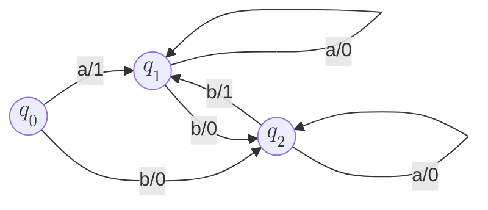
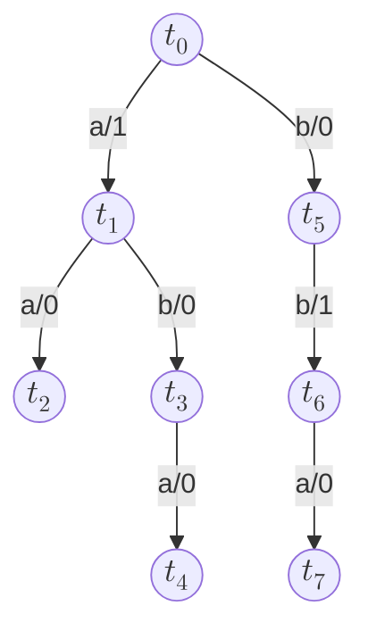
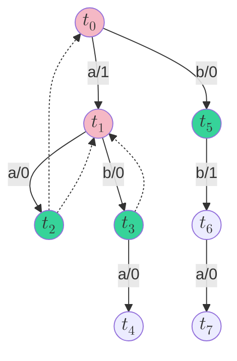

$$L^\#$$ というオートマトン学習のアルゴリズムがあります。

2022年に[Vaandrager](https://www.cs.ru.nl/~fvaan/)らによって提案された、最新のオートマトン学習のアルゴリズムです。
**apartness relation**という概念を用いて、よく知られているAngluinの $$L^\ast$$ とは少し違ったアイディアでオートマトンの学習を実現します。
学習に用いるデータ構造として、従来のobservation tableやdiscrimination treeではなく、**observation tree**というmembership query (output query) のキャッシュのようなものを利用するのも特徴です。

この記事では $$L^\#$$ の詳細や実装について、論文 [\[Vaandrager et al., 2022\]](#ref-vaandrager-et-al-2022) を参考に解説します。

**想定読者**: オートマトン理論やオートマトン学習について理解・関心がある。

{/* read more */}

import Alert from "@/components/daisyui/Alert"

# $$L^\#$$ とは

$$L^\#$$ は 2022年に[Vaandrager](https://www.cs.ru.nl/~fvaan/)によって提案された、最新のオートマトン学習のアルゴリズムです。
[\[Vaandrager et al., 2022\]](#ref-vaandrager-et-al-2022) で発表され、その実装は https://gitlab.science.ru.nl/sws/lsharp で公開されています。
また、Vaandragerによる[VSTTE 2021](https://verify.inf.usi.ch/VSTTE21)での[発表資料](https://sws.cs.ru.nl/publications/papers/fvaan/SLIDES/slidesVSTTE21.pdf)も公開されており、こちらも参考になります。

この記事では、論文[\[Vaandrager et al., 2022\]](#ref-vaandrager-et-al-2022)や[発表資料](https://sws.cs.ru.nl/publications/papers/fvaan/SLIDES/slidesVSTTE21.pdf)を参考に、$$L^\#$$ について解説します。

$$L^\#$$ はオートマトン学習 (automata learning) のアルゴリズムの一つで、次のような特徴があります。

- Angluinの $$L^\ast$$ とは異なり、**apartness relation**という「ある状態とある状態が (学習対象のオートマトンで) 異なる状態を表している」ことを表す関係 $$\#$$ を導入する。
- 従来のobservation tableやdiscrimination treeではなく、**observation tree**というmembership query (output query) のキャッシュに似たデータ構造を用いる。

計算量の観点で見ても、オートマトン学習ではmembership queryの回数が $$\mathcal{O}(k n^2 + n \log m)$$ ($$k$$ はアルファベットの大きさ、$$n$$ は学習したオートマトンの状態数、$$m$$ は反例の長さの最大値) となることがベストであると考えられているのですが、$$L^\#$$ はRivest-SchapireやTTTと同様にこの計算量に収まっています。
また[\[Vaandrager et al., 2022\]](#ref-vaandrager-et-al-2022)の実験でも、既存のアルゴリズムと比較して遜色ない性能が示されていました。

このように $$L^\#$$ は今最も注目のオートマトン学習アルゴリズムなのではないかと思います。

# 準備

集合 $$A$$ について、$$A^\ast$$ は $$A$$ の要素からなる (文字) 列の全体からなる集合を表します。
$$u \in A^\ast$$ の長さは $$|u|$$ と書きます。
$$\varepsilon$$ は長さ $$0$$ の列 (**空列**、**空文字列**) を表し、文脈に応じて $$a \in A$$ を長さ $$1$$ の列と見做すこともあります。
2つの列 $$u_1 \in A^\ast,\, u_2 \in A^\ast$$ について、$$u_1 u_2$$ を2つの文字列を並べたもの (連接) を表すものとします。

$$f\colon A \rightharpoonup B$$ は $$A$$ から $$B$$ への部分関数です。
このとき $$a \in A$$ について $$f(a)$$ が定義されているとき $$f(a)\!\!\downarrow$$ と書き、$$f(a)$$ が定義されていないとき $$f(a)\!\!\uparrow$$ と書きます。

$$L^\#$$ は論文ではMealy機械を学習するアルゴリズムとして提案されています。
そこでMealy機械について定義します。

<Alert color="success">
  **定義** (**Mealy機械**):
  Mealy機械 $$\mathcal{M}$$ は5タプル $$(I, O, Q, q_0, \delta, \lambda)$$ のことで、それぞれ次のような値となります。

  - $$I$$ は入力のアルファベット、$$O$$は出力のアルファベット、
  - $$Q$$ は状態の有限集合、$$q_0 \in Q$$ は初期状態、
  - $$\delta$$ と $$\lambda$$ はそれぞれ部分関数で、$$\delta\colon Q \times I \rightharpoonup Q$$ は遷移関数を、$$\delta\colon Q \times I \to O$$ は出力関数を表し、$$\delta(q, i)\!\!\downarrow \iff \lambda(q, i)\!\!\downarrow$$ とします。
</Alert>

参照しているMealy機械を明示するために上付き文字を付けて $$Q^\mathcal{M}, q_0^\mathcal{M}, \delta^\mathcal{M}, \lambda^\mathcal{M}$$ のように書くことがあります。
$$\delta$$ がすべての $$q \in Q,\,i \in I$$ について定義されているとき、$$\mathcal{M}$$ は**complete**と言います。

$$\delta$$ は文字列について $$\delta(q, \varepsilon) = q,\,\delta(q, i u) = \delta(\delta(q, i), u)$$ ($$i \in I,\, u \in I^\ast$$) として拡張されます。
加えて、$$\lambda$$ は文字列について $$\lambda(q, \varepsilon) = \varepsilon,\,\lambda(q, i u) = \lambda(q, i) \lambda(\delta(q, i), u)$$ として拡張されます。

状態 $$q \in Q$$ について $$\mathcal{L}(q) = \{ u \in I^\ast \mid \delta(q, u)\!\!\downarrow \}$$ と定義します。
さらに $$\llbracket q \rrbracket\colon \mathcal{L}(q) \to O^\ast$$ を $$\llbracket q \rrbracket(w) = \lambda(q, u)$$ と定義します。
2つの状態 $$q_1, q_2$$ について $$\llbracket q_1 \rrbracket = \llbracket q_2 \rrbracket$$ のとき $$q_1 \approx q_2$$ と書きます。

<Alert color="success">
  **定義** (**Mealy機械の等価性**):
  2つのMealy機械 $$\mathcal{M},\,\mathcal{N}$$ について、$$q_0^\mathcal{M} \approx q_0^\mathcal{N}$$ のとき $$\mathcal{M}$$ と $$\mathcal{N}$$ は**等価**である、と言います。
</Alert>

最後に、**Mealy機械の学習**の問題について確認します。
次の2種類のクエリを考えます。

- $$\mathrm{OUTPUT}(u)$$ (**output query**): 文字列 $$u \in I^\ast$$ に対して、学習対象のMealy機械での出力列を返すクエリです。
- $$\mathrm{EQUIV}(\mathcal{H})$$ (**equivalence query**): 仮説のMealy機械 $$\mathcal{H}$$ が学習対象のMealy機械と等価か確認し、等価な場合は $$\mathbf{yes}$$ を、等価でない場合は反例となる文字列 $$v \in I^\ast$$ (つまり、$$\lambda^\mathcal{H}(q_0^\mathcal{H}, v) \ne \mathrm{OUTPUT}(v)$$) を返します。

これらのクエリが与えられて、学習対象のオートマトンと等価なMealy機械 $$\mathcal{H}$$ (つまり $$\mathrm{EQUIV}(\mathcal{H}) = \mathbf{yes}$$ となる $$\mathcal{H}$$) を求めるのがMealy機械の学習となります。

# observation tree

まず $$L^\#$$ で重要なデータ構造となるobservation treeについて説明します。

**observation tree**はMealy機械の一種として定義されます。

<Alert color="success">
  **定義** (**observation tree**):
  Mealy機械 $$\mathcal{T} = (I, O, Q, q_0, \delta, \lambda)$$ が**tree**であるとは、各状態 $$q \in Q$$ についてユニークな文字列 $$u \in I^\ast$$ が存在して $$\delta(q_0, u) = q$$ を満たすことを言います。
  このユニークな文字列 $$u$$ を $$\mathrm{access}(q)$$ と書きます。

  Mealy機械 $$\mathcal{M}$$ に対して、すべての文字列 $$u \in \mathcal{L}(q_0^\mathcal{T})$$ について $$\llbracket q_0^\mathcal{T} \rrbracket(u) = \llbracket q_0^\mathcal{M} \rrbracket(u)$$ であるとき、$$\mathcal{T}$$ は $$\mathcal{M}$$ の**observation tree**であると呼びます。
</Alert>

次のようなMealy機械 $$\mathcal{M}_1$$ があったとします。



このMealy機械に対するobservation treeとして、例えば次のようなMealy機械 $$\mathcal{T}_1$$ が考えられます。



このとき $$\mathrm{access}(q)$$ の値は、例えば $$\mathrm{access}(t_2) = aa,\, \mathrm{access}(t_7) = bba$$ です。

observation treeはMealy機械の入力と出力を平坦に (状態の構造を忘れて) 記録したものだと考えられます。
つまり、observation treeは $$\mathrm{OUTPUT}(u)$$ のキャッシュそのものと捉えられます。
同じ文字列に対して $$\mathrm{OUTPUT}(u)$$ を呼び出すのは無駄なので、キャッシュするのは自然な考えです。

「**自然に記録している値を用いて学習が出来る**」のが $$L^\#$$ の強みの1つというわけです。

# apartness relation

次に $$L^\#$$ で重要となる**apartness relation**の概念について説明します。

[apartness relation](https://en.wikipedia.org/wiki/Apartness_relation)は構成主義の数学で用いられる道具で、[Brouwer](https://en.wikipedia.org/wiki/L._E._J._Brouwer)によって導入され[Heyting](https://en.wikipedia.org/wiki/Arend_Heyting)によって公理化されました。
apartness relationは $$\#$$ の記号で書かれ、通常の不等号 $$\ne$$ とは区別されます。

apartness relation $$\#$$ は次の公理を見たす2項関係です。

1. $$\lnot (x \mathrel{\#} x)$$ (**irreflexivity**)
2. $$x \mathrel{\#} y \Rightarrow y \mathrel{\#} x$$ (**symmetricity**)
3. $$x \mathrel{\#} y \Rightarrow x \mathrel{\#} z \lor y \mathrel{\#} z$$ (**co-transitivity**)

Mealy機械 $$\mathcal{M}$$ について、次のようなapartness relationを定義できます。

<Alert color="success">
  **定義** (**$$\mathcal{M}$$ 上の (weak) apartness relation**):
  Mealy機械 $$\mathcal{M}$$ について、$$\mathcal{M}$$ 上の (weak) apartness relation $$\#_\mathcal{M} \subseteq Q^\mathcal{M} \times Q^\mathcal{M}$$ を次のように定義します。

  $$
  q_1 \mathrel{\#_\mathcal{M}} q_2 \iff \exists u \in \mathcal{L}(q_1) \cap \mathcal{L}(q_2).\ \lambda^\mathcal{M}(q_1, u) \ne \lambda^\mathcal{M}(q_2, u)
  $$

  加えて、$$q_1, q_2 \in Q^\mathcal{M}$$ について $$q_1 \mathrel{\#_\mathcal{M}} q_2$$ のとき、$$\mathrm{witness}(q_1, q_2) \in \mathcal{L}(q_1) \cap \mathcal{L}(q_2)$$ を $$\lambda(q_1, u) \ne \lambda(q_2, u)$$ となる文字列 $$u$$ と定義します。
</Alert>

このapartness relationは**irreflexivity**と**symmetricity**を満たしますが、**co-transitivity**を満たさない場合があります。
Mealy機械 $$\mathcal{M}$$ がcompleteでない場合、$$q_1 \mathrel{\#_\mathcal{M}} q_2$$ でも $$\delta(q, \mathrm{witness}(q_1, q_2))\!\!\uparrow$$ のとき、$$q_1 \mathrel{\#_\mathcal{M}} q$$ とも $$q_2 \mathrel{\#_\mathcal{M}} q$$ とも言えない可能性があるからです[^complete-apartness]。

[^complete-apartness]: つまり、Mealy機械 $$\mathcal{M}$$ がcompleteなら、co-transitivityも満たしている、ということでもあります。

例えば、上の $$\mathcal{T}_1$$ では $$t_1 \mathrel{\#_{\mathcal{T}_1}} t_5$$ で $$\mathrm{witness}(t_1, t_5) = b$$ ですが、$$\delta(t_2, b)\!\!\uparrow$$ のため $$t_1 \mathrel{\#_{\mathcal{T}_1}} t_2$$ とも $$t_5 \mathrel{\#_{\mathcal{T}_1}} t_2$$ とも言えません。

Mealy機械 $$\mathcal{M}$$ のobservation tree $$\mathcal{T}$$について、$$\mathcal{T}$$ 上のapartness relation $$\#_\mathcal{T}$$ は、$$\mathcal{M}$$ と次のような関係があります。

<Alert color="info">
  **補題1**:
  Mealy機械 $$\mathcal{M}$$ のobservation tree $$\mathcal{T}$$について $$t_1 \mathrel{\#_\mathcal{T}} t_2$$ ($$t_1, t_2 \in Q^\mathcal{T}$$) の場合を考えます。
  ここで $$q_1 = \delta^\mathcal{M}(q_0^\mathcal{M}, \mathrm{access}(t_1)),\, q_2 = \delta^\mathcal{M}(q_0^\mathcal{M}, \mathrm{access}(t_2))$$ とおくと、$$q_1 \not\approx q_2$$ が成り立ちます。
</Alert>

observation treeが (定義されている範囲で) 元のMealy機械の出力と等しいことから、このことはすぐに分かります。

この補題から、observation treeのapartness relationを考えることで、状態の組が少なくとも学習対象のMealy機械でも異なる状態の組を表している、ということが分かります。

Mealy機械 $$\mathcal{M}$$ 上のapartness relationについて、co-transitivityを満たさない場合があると定義した際に述べました。
しかし、次の**weak co-transitivity**であれば常に成り立ちます。

<Alert color="info">
  **補題2** (**weak co-transitivity**): Mealy機械 $$\mathcal{M}$$ の状態 $$q, t_1, t_2 \in Q^\mathcal{M}$$ について、次の命題が成り立ちます。

  $$
  t_1 \mathrel{\#_\mathcal{M}} t_2 \land \delta^\mathcal{M}(q, \mathrm{witness}(t_1, t_2))\!\!\downarrow
  \Rightarrow t_1 \mathrel{\#_\mathcal{M}} q \lor t_2 \mathrel{\#_\mathcal{M}} q
  $$
</Alert>

問題となる $$\delta^\mathcal{M}(q, \mathrm{witness}(t_1, t_2))\!\!\uparrow$$ の場合を潰した条件になっています。

weak co-transitivityは学習の際に、区別可能な (apartness relationに含まれる) 状態の組を増やすのに役に立ちます。

# $$L^\#$$ アルゴリズム

ここからは $$L^\#$$ のアルゴリズム本体について解説していきます。

これまで説明してきたように $$L^\#$$ ではobservation treeを主なデータ構造として利用します。
そして、observation treeはoutput queryのキャッシュとして振舞います。
$$L^\#$$ の実行中に管理されるobservation tree $$\mathcal{T}$$ について、output queryの呼び出しによって $$\mathcal{T}$$ が更新されていくことを明示するために、そのようなoutput queryの呼び出しを $$\mathrm{OUTPUT}_\mathcal{T}(u)$$ と書くことにします。

$$L^\#$$ は $$\mathcal{T}$$ に加えて、次の2つの集合と1つの関係 $$(B, F, \rightsquigarrow)$$ を管理しながら実行されます。

- $$B \subseteq Q^\mathcal{T}$$ は**basis集合**で、学習対象のMealy機械と対応付いている状態の集合です。basis集合の2つの状態 $$t_1, t_2 \in B$$ について $$t_1 \mathrel{\#_\mathcal{T}} t_2$$ が成り立ちます。
- $$F \subseteq Q^\mathcal{T} \setminus B$$ は**frontier集合**で、basis集合に含まれる状態から1文字で遷移できる状態を集めたものです。frontier集合の状態が、basis集合のすべての状態から区別できるようになったとき、その状態はfrontier集合からbasis集合へと移動します。
- $$\rightsquigarrow \subseteq F \times B$$ はfrontier集合の状態から、まだ区別できていないbasis集合の状態への写像である関係です。$$\rightsquigarrow = \{ (s, t) \in F \times B \mid \lnot (s \mathrel{\#_\mathcal{T}} t) \}$$ を満たすように更新されています。

frontier集合の状態 $$s \in F$$ について $$[s]_\rightsquigarrow \subseteq B$$ を $$[s]_\rightsquigarrow = \{ t \in B \mid s \rightsquigarrow t \}$$ と定義します。

## 仮説のオートマトンの構築

$$\mathcal{T}$$ からの仮説のMealy機械 $$\mathcal{H}$$ の構築の説明のために、いくつか用語を定義します。

<Alert color="success">
  **定義** (**isolated**, **identified**, **complete**):
  observation tree $$\mathcal{T}$$ と $$(B, F, \rightsquigarrow)$$ について、

  - frontier集合の状態 $$s \in F$$ について、$$|[s]_\rightsquigarrow| = 0$$ のとき $$q$$ は**isolated**であると呼び、$$|[s]_\rightsquigarrow| = 1$$ のとき $$q$$ は**identified**であると呼びます。
  - basis集合の状態 $$t \in B$$ について、すべての入力文字 $$i \in I$$ について $$\delta^\mathcal{T}(q_0, \mathrm{access}(q)\;i)\!\!\downarrow$$ かつ $$\delta^\mathcal{T}(q_0, \mathrm{access}(q)\;i) \in B \cup F$$ のとき、$$t$$ は**complete**であると呼びます。
  - frontier集合 $$F$$ のすべての状態がidentifiedのとき $$F$$ は**identified**であると呼び、basis集合 $$B$$ のすべての状態がcompleteのとき $$B$$ は**complete**であると呼びます。
</Alert>

これらの用語について、もう少し補足の説明をします。

- $$s \in F$$ が**isolated**ということは、今学習対象のMealy機械と対応付いているすべての状態と区別されているということです。つまり、isolatedな $$s$$ は新しいbasis集合の状態になれる状態ということです。
- $$s \in F$$ が**identified**ということは**これまでに記録した限りでは**basis集合の特定の状態と、学習対象のMealy機械上では同じ状態を表していると考えられます。つまり、$$\mathcal{T}$$ で $$s$$ に遷移する場合、仮説のMealy機械 $$\mathcal{H}$$ では $$s \rightsquigarrow t$$ となる $$t$$ に対応する状態へと遷移することになります。
- $$t \in B$$ が**complete**ということは、仮説のMealy機械を構築する際に遷移先の状態が存在せず遷移できないということが起こらないことを意味しています。

例として、observation treeを上の $$\mathcal{T}_1$$ として $$B = \{ t_0, t_1 \},\, F = \{ t_2, t_3, t_5 \}$$ とします。
次の図は、このときの様子を図にしたもので、赤いノードがbasis集合の状態を、緑のノードがfrontier集合の状態を表し、点線の矢印は $$\rightsquigarrow$$ の関係を表します。



このとき、

- $$[t_2]_\rightsquigarrow = \{ t_0, t_1 \}$$ なので $$t_2 \in F$$ はisolatedでもidentifiedでもない状態です。
- $$[t_3]_\rightsquigarrow = \{ t_1 \}$$ なので $$t_3 \in F$$ はidentifiedな状態です。
- $$[t_5]_\rightsquigarrow = \emptyset$$ なので $$t_5 \in F$$ はisolatedな状態です。

また、$$B = \{ t_0, t_1 \}$$ は各入力文字 $$i \in \{ a, b \}$$ について遷移先が定義されているため、$$B$$ はcompleteです。

observation tree $$\mathcal{T}$$から仮説のMealy機械 $$\mathcal{H}$$ の構築は、次のように行います。

<Alert color="success">
  **定義** (**仮説のMealy機械**):
  observation tree $$\mathcal{T} = (I, O, Q^\mathcal{T}, q_0^\mathcal{T}, \delta^\mathcal{T}, \lambda^\mathcal{T})$$ と $$(B, F, \rightsquigarrow)$$ について、$$F$$ がidentifiedかつ $$B$$ がcompleteな場合を考えます。
  このとき、仮説のMealy機械 $$\mathcal{H} = (I, O, Q^\mathcal{H}, q_0^\mathcal{H}, \delta^\mathcal{H}, \lambda^\mathcal{H})$$ は次のように定義されます。

  - $$Q^\mathcal{H} = B$$、$$q_0^\mathcal{H} = t_0$$、
  - $$\delta^\mathcal{H}(q, i) = t$$ ($$t = \delta^\mathcal{T}(q, i)$$ かつ $$t \in B$$ の場合)、または $$\delta^\mathcal{H}(q, i) = t'$$ ($$s = \delta^\mathcal{T}(q, i) \land s \in F$$ かつ $$s \rightsquigarrow t'$$ の場合)、
  - $$\lambda^\mathcal{H}(q, i) = \lambda^\mathcal{T}(q, i)$$。
</Alert>

$$F$$ がidentifiedかつ $$B$$ がcompleteとしているので、仮説のMealy機械は正しく定義されます。

## $$\mathcal{H}$$ と $$\mathcal{T}$$ の一貫性

仮説のMealy機械はfrontier集合までの状態を元に構築しているため、場合によっては $$\mathcal{H}$$ と $$\mathcal{T}$$ が**一貫していない**、つまり、ある文字列で区別できる状態に遷移してしまう ($$\delta^\mathcal{H}(q_0^\mathcal{H}, u) \mathrel{\#_\mathcal{T}} \delta^\mathcal{T}(q_0^\mathcal{T}, u)$$ となる文字列 $$u \in I^\ast$$ が存在する) 場合があります。
このような場合、$$\mathcal{H}$$ は明らかに学習対象のMealy機械と等価ではないので、事前にチェックしておきたいです。

具体的には、次のようなアルゴリズムで、$$\mathcal{H}$$ が $$\mathcal{T}$$ と一貫しているかチェックできます。

```pseudocode
\begin{algorithm}
  \caption{Check consistency between $\mathcal{T}$ and $\mathcal{H}$}
  \begin{algorithmic}
    \FUNCTION{CheckConsistency}{$\mathcal{H}$}
      \STATE $\mathit{queue} \gets$ \textbf{new} queue of $Q^\mathcal{T} \times Q^\mathcal{H}$
      \STATE $\mathrm{enqueue}(\mathit{queue}, (q_0^\mathcal{T}, q_0^\mathcal{H}))$
      \WHILE{$\mathit{queue}$ is not empty}
        \STATE $(t, q) \gets \mathrm{dequeue}(\mathit{queue})$
        \IF{$t \mathrel{\#_\mathcal{T}} q$}
          \RETURN $\mathrm{access}(t)$
        \ELSE
          \FOR{$i \in I \land \delta^\mathcal{T}(t, i)\!\!\downarrow$}
            \STATE $\mathrm{enqueue}(\mathit{queue}, (\delta^\mathcal{T}(t, i), \delta^\mathcal{H}(q, i)))$
          \ENDFOR
        \ENDIF
      \ENDWHILE
      \RETURN $\mathbf{yes}$
    \ENDFUNCTION
  \end{algorithmic}
\end{algorithm}
```

内容は $$\mathcal{T}$$ の状態と $$\mathcal{H}$$ の状態の組 $$(t, q)$$ を、初期状態から幅優先探索で $$t \mathrel{\#_\mathcal{T}} q$$ となっていないか探索しているだけです[^from-frontier]。
また、返り値は一貫している場合は $$\mathbf{yes}$$、一貫していない場合は $$\delta^\mathcal{H}(q_0^\mathcal{H}, u) \mathrel{\#_\mathcal{T}} \delta^\mathcal{T}(q_0^\mathcal{T}, u)$$ となる文字列 $$u$$ を返します。

[^from-frontier]: 説明を論文の内容に合わせるためにこのようにしていますが、$$\mathcal{T}$$ の方の状態がbasis集合かfrontier集合の状態である間は $$\lnot (t \mathrel{\#_\mathcal{T}} q)$$ のはずなので、frontier集合の先の状態から始めた方が効率的なのではないかと考えています。

こうすることで、比較的重いクエリであるequivalence queryを呼び出す回数を減らせます。

## $$L^\#$$ のアルゴリズム本体

$$L^\#$$ は次のようにして、オートマトンを学習していきます。

1. $$\mathcal{T}$$ を初期状態 $$t_0$$ のみのtree、$$B$$ を $$\{ t_0 \}$$、$$F$$ と $$\rightsquigarrow$$ を空集合で初期化します。
2. 次の処理を繰り返します。
   1. $$\rightsquigarrow$$ を $$\mathcal{T}$$ と $$B, F$$ に合わせて更新します。
   2. **promotion**: $$F$$ にisolatedな状態 $$s \in F$$ がある場合、$$s$$ を $$B$$ に移動し、繰り返しをやり直します。
   3. **completion**: $$B$$ にcompleteでない状態 $$t \in B$$ がある場合、$$\delta^\mathcal{T}(q, i)\!\!\uparrow$$ または $$\delta^\mathcal{T}(q, i) \notin F$$ である $$i \in I$$ について $$\mathrm{OUTPUT}_\mathcal{T}(\mathrm{access}(t)\;i)$$ を呼び出し、$$\delta^\mathcal{T}(q, i)$$ を $$F$$ に追加し、繰り返しをやり直します。
   4. **identification**: $$F$$ にidentifiedでない状態 $$s \in F$$ がある場合、2つのbasis集合の状態 $$t_1, t_2 \in [s]_\rightsquigarrow$$ について $$\mathrm{OUTPUT}_\mathcal{T}(\mathrm{access}(s)\;\mathrm{witness}(t_1, t_2))$$ を呼び出し、繰り返しをやり直します。
   5. ここから**equivalence checking**: $$B$$ がcompleteかつ $$F$$ がidentifiedなので、仮説のオートマトン $$\mathcal{H}$$ を構築します。
   6. $$\text{\htmlClass{katex-ps-funcname}{CheckConsistency}}(\mathcal{H})$$ を呼び出します。
      - 反例の文字列 $$x$$ を返した場合、$$x$$ を記憶しておきます。
      - $$\mathbf{yes}$$ を返した場合、$$\mathrm{EQUIV}(\mathcal{H})$$ を呼び出します。
        - 反例の文字列 $$y$$ を返した場合、$$\delta^\mathcal{H}(q_0^\mathcal{H}, x) \mathrel{\#_\mathcal{T}} \delta^\mathcal{T}(q_0^\mathcal{T}, x)$$ となる $$y$$ の接頭辞で最小の $$x$$ を探します。
        - これも $$\mathbf{yes}$$ を返した場合、$$\mathcal{H}$$ は学習対象のMealy機械と等価なので、それを返して学習を終了します。
    7. 反例の文字列 $$x$$ を $$\mathcal{T}$$ に反映する手続き $$\text{\htmlClass{katex-ps-funcname}{ProcCounterEx}}(\mathcal{H}, x)$$ を呼び出します (この手続き<span className="katex-ps-funcname">ProcCounterEx</span>については**後で説明**します)。

つまり、$$F$$ のisolatedな状態を $$B$$ に移動しつつ (promotion)、$$B$$ がcompleteかつ $$F$$ がidentifiedとなるように処理を繰り返し、仮説のMealy機械が作れるようになったら、それを使って $$\text{\htmlClass{katex-ps-funcname}{CheckConsistency}}(\mathcal{H})$$ や $$\mathrm{EQUIV}(\mathcal{H})$$ を呼び出し、返された反例を $$\mathcal{T}$$ に反映していく、というのが $$L^\#$$ の流れになります。

もう少し具体的な疑似コードで説明したものが、次のアルゴリズム (<span className="katex-ps-funcname">LSharp</span>) になります。

```pseudocode
\begin{algorithm}
  \caption{The $L^\#$ algorithm}
  \begin{algorithmic}
    \FUNCTION{LSharp}{}
      \STATE $\mathcal{T} \gets $ a tree with an intial state $t_0$
      \STATE $B \gets \{ t_0 \}$ and $F \gets \emptyset$
      \REPEAT
        \STATE $\rightsquigarrow \gets \{ (s, t) \in F \times B \mid \lnot (s \mathrel{\#_\mathcal{T}} t) \}$
        \STATE \COMMENT{\textit{promotion}:}
        \IF{$s \in F \land [s]_\rightsquigarrow = \emptyset$}
          \STATE $B \gets B \cup \{ s \}$ and $F \gets F \setminus \{ s \}$
          \CONTINUE
        \ENDIF
        \STATE \COMMENT{\textit{completion}:}
        \IF{$t \in B \land i \in I \land (\delta^\mathcal{T}(t, i)\!\!\uparrow \lor \delta^\mathcal{T}(t, i) \notin B \cup F)$}
          \STATE $\mathrm{OUTPUT}_\mathcal{T}(\mathrm{access}(t)\;i)$
          \STATE $F \gets F \cup \{ \delta^\mathcal{T}(t, i) \}$
          \CONTINUE
        \ENDIF
        \STATE \COMMENT{\textit{identification}:}
        \IF{$s \in F \land t_1, t_2 \in [s]_\rightsquigarrow$}
          \STATE $\mathrm{OUTPUT}_\mathcal{T}(\mathrm{access}(s)\;\mathrm{witness}(t_1, t_2))$
          \CONTINUE
        \ENDIF
        \STATE \COMMENT{\textit{Now, $B$ is complete and $F$ is identified.}}
        \STATE $\mathcal{H} \gets$ the hypothesis Mealy machine constructed from $\mathcal{T}$ and $(B, F, \rightsquigarrow)$
        \STATE $x \gets$ \Call{CheckConsistency}{$\mathcal{H}$}
        \IF{$x = \mathbf{yes}$}
          \STATE $y \gets \mathrm{EQUIV}(\mathcal{H})$
          \IF{$y \ne \mathbf{yes}$}
            \STATE $\mathrm{OUTPUT}_\mathcal{T}(y)$
            \STATE $x \gets$ the shortest prefix of $y$ \textbf{s.t.} $\delta^\mathcal{T}(q_0^\mathcal{T}, x) \mathrel{\#_\mathcal{T}} \delta^\mathcal{H}(q_0^\mathcal{H}, x)$
          \ENDIF
        \ENDIF
        \IF{$x \ne \mathbf{yes}$}
          \STATE \Call{ProcCounterEx}{$\mathcal{H}, x$}
        \ENDIF
      \UNTIL{$\mathrm{EQUIV}(\mathcal{H}) = \mathbf{yes}$}
      \RETURN $\mathbf{H}$
    \ENDFUNCTION
  \end{algorithmic}
\end{algorithm}
```

promotionやcompletionでは $$B$$ や $$F$$ が変化するので、学習が進んでいることが分かります。
また、identificationではweak co-transitivity (補題2) により、このあとの $$\rightsquigarrow$$ の更新で $$|[s]_\rightsquigarrow|$$ が小さくなるため、同様に学習が進みます。

promotion、completion、identificationでの $$\mathrm{OUTPUT}(u)$$ の呼び出し回数は、identificationでのものが支配的です。
$$k = |I|,\, n = |B|$$ とすると、$$|F|$$ の大きさは $$k n$$ で抑えられて、各 $$s \in F$$ について $$[s]_\rightsquigarrow$$ の大きさは高々 $$n$$ のため、identificationでの $$\mathrm{OUTPUT}(w)$$ の呼び出し回数は $$\mathcal{O}(k n^2)$$ で抑えられます。

後述するように、 $$\text{\htmlClass{katex-ps-funcname}{ProcCounterEx}}(\mathcal{H}, x)$$ は反例の文字列の長さ $$m = |x|$$ について $$\mathcal{O}(\log m)$$ 回の $$\mathrm{OUTPUT}(u)$$ の呼び出し回数で実現できます。
$$\text{\htmlClass{katex-ps-funcname}{ProcCounterEx}}(\mathcal{H}, x)$$ の呼び出し回数は高々 $$n$$ 回なので、全体での $$\mathrm{OUTPUT}(w)$$ の呼び出し回数は $$\mathcal{O}(k n^2 + n \log m)$$ で抑えられます。

計算量についての詳細な解析は論文を参照してください。

## 反例の処理

最後に、反例の処理を行う<span className="katex-ps-funcname">ProcCounterEx</span>について説明します。

反例の処理は新しい状態が増えることを目標とします。
$$L^\#$$ において新しい状態が増えるとは、$$F$$ の状態が $$B$$ へと移動する (promotion) ことを意味します。
そして、promotionが行なわれるためには、その $$F$$ の状態がisolatedにならなければいけません。

仮説のオートマトンを構築した段階では、frontier集合の状態 $$s \in F$$ はすべてidentifiedなので$$s \rightsquigarrow t$$ となる $$t \in B$$ が1つ存在しています。
そのため<span className="katex-ps-funcname">ProcCounterEx</span>では、その中の$$\mathrm{OUTPUT}_\mathcal{T}(u)$$の呼び出しで、ある $$t \in F$$ が $$s \mathrel{\#_\mathcal{T}} t$$ となるように $$\mathcal{T}$$ が更新されればいいわけです。

<span className="katex-ps-funcname">ProcCounterEx</span>は次のようなアルゴリズムになります[^proccounterex-paper-diff]。

[^proccounterex-paper-diff]: 実のところ、このアルゴリズムは論文のものとは、再帰関数を明示的な繰り返しにするなど、かなり異なった書き方になっています。ですが本質的な処理は論文のものと変わらないはずです。また、論文では停止条件を $$\delta^\mathcal{T}(q_0^\mathcal{T}, x) \in B \cup F$$ としていましたが、後述の理由から $$\delta^\mathcal{T}(q_0^\mathcal{T}, x) \in B$$ となることは無いため $$B$$ を省いて $$\delta^\mathcal{T}(q_0^\mathcal{T}, x) \in F$$ としています。

```pseudocode
\begin{algorithm}
  \caption{}
  \begin{algorithmic}
    \PROCEDURE{ProcCounterEx}{$\mathcal{H}, x$}
      \STATE $v \gets$ the unique prefix of $x$ \textbf{s.t.} $\delta^\mathcal{T}(q_0^\mathcal{T}, v) \in F$
      \WHILE{$|v| < |x|$} \COMMENT{\textit{i.e. $\delta^\mathcal{T}(q_0^\mathcal{T}, x) \notin F$}}
        \STATE $q \gets \delta^\mathcal{H}(q_0^\mathcal{H}, x)$ and $t \gets \delta^\mathcal{T}(q_0^\mathcal{T}, x)$
        \STATE $w \gets \mathrm{witness}(q, t)$
        \COMMENT{\textit{Invariant: $\ q \mathrel{\#_\mathcal{T}} t$}}
        \STATE $\ell \gets |v| + \lfloor \frac{|x| - |v|}{2} \rfloor$
        \STATE $x_1 \gets x[1 \dots \ell]$ and $x_2 \gets x[\ell + 1 \dots |x|]$
        \STATE $q_1 \gets \delta^\mathcal{H}(q_0^\mathcal{H}, x_1)$ and $t_1 \gets \delta^\mathcal{T}(q_0^\mathcal{T}, x_1)$
        \STATE $\mathrm{OUTPUT}_\mathcal{T}(\mathrm{access}(q_1)\;x_2\;w)$
        \IF{$q_1 \mathrel{\#_\mathcal{T}} t_1$}
          \STATE $x \gets x_1$
        \ELSE
          \STATE $x \gets \mathrm{access}(q_1)\;x_2$
          \STATE $v \gets$ the unique prefix of $x$ \textbf{s.t.} $\delta^\mathcal{T}(q_0^\mathcal{T}, v) \in F$
        \ENDIF
      \ENDWHILE
    \ENDPROCEDURE
  \end{algorithmic}
\end{algorithm}
```

<span className="katex-ps-funcname">LSharp</span>の中で<span className="katex-ps-funcname">ProcCounterEx</span>を呼び出す前に $$\mathrm{OUTPUT}_\mathcal{T}(x)$$ を呼んでいるので $$\delta^\mathcal{T}(q_0^\mathcal{T}, x)\!\!\downarrow$$ ですが、$$x$$ の接頭辞のどこかで $$B$$ の状態から $$F$$ の状態へ遷移しているはずです。
そのような接頭辞をアルゴリズム中では $$v$$ として、<span className="katex-ps-funcname">ProcCounterEx</span>では次の不変条件を保ちながら、$$v$$ 以降の $$x$$ の文字列の長さを二分探索のように半分にしていきます。

- $$\delta^\mathcal{H}(q_0^\mathcal{H}, x) \mathrel{\#_\mathcal{T}} \delta^\mathcal{T}(q_0^\mathcal{T}, x)$$
- $$v$$ は $$x$$ の接頭辞で $$\delta^\mathcal{T}(q_0^\mathcal{T}, v) \in F$$ であるもの (ちょうど1つしか存在しない)

ループが終わったとき $$x = v$$ のため $$\delta^\mathcal{T}(q_0^\mathcal{T}, x) \in F$$ となります。
さらに $$q = \delta^\mathcal{H}(q_0^\mathcal{H}, x),\, t = \delta^\mathcal{T}(q_0^\mathcal{T}, x)$$ としたとき、不変条件から $$q \mathrm{\#_\mathcal{T}} t$$ が言えます。
よって $$t$$ がisolatedとなるため、新しい状態が生じるわけです。

次に、ループ中に不変条件が本当に保たれていることを確認していきます。
<span className="katex-ps-funcname">ProcCounterEx</span>では、$$\mathrm{OUTPUT}_\mathcal{T}(\mathrm{access}(q_1)\;x_2\;w)$$ を呼び出したあとに $$q_1 \mathrel{\#_\mathcal{T}} t_1$$ で分岐を行なっています。
$$q_1 \mathrel{\#_\mathcal{T}} t_1$$ が真の場合は $$x \gets x_1$$ としますが、この場合は接頭辞も変わらないため、明らかに不変条件を満たしています。

一方、$$\lnot (q_1 \mathrel{\#_\mathcal{T}} t_1)$$ の場合はどうでしょうか。
$$t_2 = \delta^\mathcal{T}(q_0^\mathcal{T}, \mathrm{access}(q_1)\;x_2)$$ とおきます。
$$q = \delta^\mathcal{H}(\mathrm{access}(q_1)\;x_2)$$ なので $$q \mathrel{\#_\mathcal{T}} t_2$$ が言えればよいです。
このとき $$w = \mathrm{witness}(q, t)$$ で $$\mathrm{OUTPUT}_\mathcal{T}(\mathrm{access}(q_1)\;x_2\;w)$$ を事前に呼び出していて $$\delta^\mathcal{T}(t_2, w)\!\!\downarrow$$ となり、weak co-transitivity (補題2) より $$q \mathrel{\#_\mathcal{T}} t_2 \lor t \mathrel{\#_\mathcal{T}} t_2$$ が分かります。
そのため $$\lnot (t \mathrel{\#_\mathcal{T}} t_2)$$ が言えれば、目的の命題が得られます。

ここで、次の補題を考えます。

<Alert color="info">
  **補題3**:
  Mealy機械 $$\mathcal{M}$$ と状態 $$q_1, q_2 \in Q$$、文字列 $$u \in I^\ast$$ について、次の命題が成り立つ。

  $$
  \lnot (q_1 \mathrel{\#_\mathcal{M}} q_2) \land \delta(q_1, u)\!\!\downarrow \land \delta(q_2, u)\!\!\downarrow
  \Rightarrow
  \lnot (\delta(q_1, u) \mathrel{\#_\mathcal{M}} \delta(q_2, u))
  $$
</Alert>

$$\lnot (q_1 \mathrel{\#_\mathcal{M}} q_2)$$ であれば、そこからの遷移が定義されているのであればその先でもapartness relationが成立しないことが維持されるということです。

ここで $$\mathrm{access}(t) = x_1\;x_2$$ かつ $$\mathrm{access}(t_2) = \mathrm{access}(q_1)\;x_2$$ であることから、$$t$$ および $$t_2$$ はそれぞれ $$x_1$$ と $$q_1$$ から文字列 $$x_2$$ で遷移した先の状態なことが分かります。
よって、分岐条件 $$\lnot (q_1 \mathrel{\#_\mathcal{T}} t_1)$$ と上の補題より $$\lnot (t \mathrel{\#_\mathcal{T}} t_2)$$ が分かり、$$q \mathrel{\#_\mathcal{T}} t_2$$ が示せます。

最後に、このアルゴリズムが正しく停止するのか考えます。
基本的には $$|x| - |v|$$ は減少していくのですが $$|x| - |v| = 1$$ の場合 $$\lfloor (|x| - |v|) / 2 \rfloor == 0$$ のため、$$\lnot (q_1 \mathrel{\#_\mathcal{T}} t_1)$$ で分岐した場合 $$|x| - |v|$$ が減少せず、一見すると問題になりそうです。
ですが $$|x| - |v| = 1$$ ということは $$v = x_1$$ となっていて $$t_1 \rightsquigarrow q_1$$ のため $$|\mathrm{access}(q_1)| < |x_1|$$ になるため $$x$$ の文字数が減少します。

さらに、この分岐で $$x$$ を $$\mathrm{access}(q_1)\;x_2$$ としたときに $$x_2$$ が短すぎると、そのあと $$x$$ の接頭辞で $$\delta^\mathcal{T}(q_0^\mathcal{T}, v) \in F$$ となる $$v$$ が見つからないという事態が起こりそうにも思えます。
しかし、実際にはそのようなことは起こりません。
なぜなら $$\delta^\mathcal{T}(q_0^\mathcal{T}, \mathrm{access}(q_1)\;x_2) \in B$$ だとすると $$q = t_2$$ のため、明らかに先程示した $$q \mathrel{\#_\mathcal{T}} t_2$$ と矛盾するからです。

よって<span className="katex-ps-funcname">ProcCounterEx</span>は正しく動作します。

# 実装

最後に、ここまで説明してきた $$L^\#$$ をScalaで実装したものを示します。
空行を含めて280行程度のプログラムで、そこそこコンパクトに実装できているのではないかと思います。

```scala showLineNumbers
import scala.annotation.tailrec
import scala.collection.mutable
import scala.util.boundary

final case class Mealy[Q, I, O](
    initial: Q,
    transition: Map[(Q, I), (O, Q)]
):
  def run(is: Seq[I]): (Seq[O], Q) =
    val os = Seq.newBuilder[O]
    var q = initial
    for i <- is do
      val (o, q1) = transition((q, i))
      os.addOne(o)
      q = q1
    (os.result(), q)

trait SUL[I, O]:
  def trace(is: Seq[I]): Seq[O]

  def findCounterEx(h: Mealy[?, I, O]): Option[Seq[I]]

  def inputAlphabet: Set[I]

  def outputAlphabet: Set[O]

final case class OTree[I, O](
    edges: Map[I, (O, OTree[I, O])] = Map.empty[I, (O, OTree[I, O])]
):
  def contains(is: Seq[I]): Boolean = get(is).isDefined

  def apply(is: Seq[I]): OTree[I, O] = get(is).get

  def get(is: Seq[I]): Option[OTree[I, O]] =
    is.headOption match
      case None    => Some(this)
      case Some(i) => edges.get(i).flatMap(_._2.get(is.tail))

  def inserted(ios: Seq[(I, O)]): OTree[I, O] =
    ios.headOption match
      case None => this
      case Some((i, o)) =>
        edges.get(i) match
          case None =>
            val t = OTree(Map.empty).inserted(ios.tail)
            OTree(edges ++ Map(i -> (o, t)))
          case Some((_, t)) =>
            OTree(edges ++ Map(i -> (o, t.inserted(ios.tail))))

  infix def apart(that: OTree[I, O]): Option[Seq[I]] =
    val queue = mutable.Queue.empty[(Seq[I], OTree[I, O], OTree[I, O])]
    queue.enqueue((Seq.empty, this, that))
    boundary:
      while queue.nonEmpty do
        val (is, t1, t2) = queue.dequeue
        for
          i <- t1.edges.keySet ++ t2.edges.keySet
          ((o1, t1), (o2, t2)) <- t1.edges.get(i) zip t2.edges.get(i)
        do
          if o1 != o2 then boundary.break(Some(is ++ Seq(i)))
          else queue.enqueue((is ++ Seq(i), t1, t2))
      None

  infix def ##(that: OTree[I, O]): Boolean =
    (this apart that).isDefined

final class LSharp[I, O](val sul: SUL[I, O]):
  type S = Seq[I]

  var root: OTree[I, O] = OTree()

  val basis = mutable.Set.empty[S]
  val frontier = mutable.Map.empty[S, Set[S]]

  val witnessCache = mutable.Map.empty[(S, S), Seq[I]]

  def learn(): Mealy[S, I, O] =
    basis.add(Seq.empty)

    while true do
      updateFrontier()

      if !(promotion() || completion() || identification()) then
        val h = checkHypothesis()
        if h.isDefined then return h.get

    sys.error("unreachable")

  private def outputQuery(is: Seq[I]): Unit =
    if root.contains(is) then return

    val os = sul.trace(is)
    root = root.inserted(is.zip(os))

  private def addBasis(t: S): Unit =
    basis.add(t)
    val tt = root(t)
    frontier.mapValuesInPlace: (s, ts) =>
      val st = root(s)
      if !(tt ## st) then ts ++ Set(t)
      else ts

  private def addFrontier(s: S): Unit =
    val st = root(s)
    val ts = basis.iterator.filter: t =>
      val tt = root.get(t).get
      !(tt ## st)
    frontier(s) = ts.toSet

  private def updateFrontier(): Unit =
    frontier.mapValuesInPlace: (s, ts) =>
      val st = root(s)
      ts.filter: t =>
        val tt = root(t)
        !(tt ## st)

  private def buildHypothesis(): Mealy[S, I, O] =
    val transition = Map.newBuilder[(S, I), (O, S)]
    val initial = Seq.empty[I]

    for t <- basis do
      val tt = root(t)
      for (i, (o, _)) <- tt.edges do
        var t1 = t ++ Seq(i)
        if frontier.contains(t1) then t1 = frontier(t1).head
        transition.addOne((t, i), (o, t1))

    Mealy(initial, transition.result())

  private def checkConsistency(h: Mealy[S, I, O]): Option[S] =
    val queue = mutable.Queue.empty[(S, OTree[I, O], S)]
    queue.enqueue((Seq.empty, root, h.initial))

    while queue.nonEmpty do
      val (u, tt, q) = queue.dequeue()
      val qt = root(q)
      (tt apart qt) match
        case None =>
          for (i, (_, tt1)) <- tt.edges do
            val q1 = h.transition((q, i))._2
            queue.addOne((u ++ Seq(i), tt1, q1))
        case Some(_) => return Some(u)

    None

  private def computeWitness(t1: S, t2: S): Seq[I] =
    witnessCache.getOrElseUpdate((t1, t2), (root(t1) apart root(t2)).get)

  private def promotion(): Boolean =
    val isolatedStates = frontier.iterator
      .filter(_._2.isEmpty)
      .map(_._1)
      .toSeq

    if isolatedStates.isEmpty then return false

    val s = isolatedStates.head
    frontier.remove(s)
    addBasis(s)

    true

  private def completion(): Boolean =
    val incompletePairs = basis.iterator
      .flatMap(q => sul.inputAlphabet.map((q, _)))
      .filter: (t, i) =>
        val s = t ++ Seq(i)
        !root.contains(s) || !basis.contains(s) && !frontier.contains(s)
      .toSeq

    if incompletePairs.isEmpty then return false

    for (t, i) <- incompletePairs do
      val s = t ++ Seq(i)
      outputQuery(s)
      addFrontier(s)

    true

  private def identification(): Boolean =
    val unidentifiedStates = frontier.keys
      .filter(p => frontier(p).size >= 2)
      .toSeq

    if unidentifiedStates.isEmpty then return false

    val s = unidentifiedStates.head
    val Seq(t1, t2) = frontier(s).take(2).toSeq
    val w = computeWitness(t1, t2)
    outputQuery(s ++ w)

    true

  private def checkHypothesis(): Option[Mealy[S, I, O]] =
    val h = buildHypothesis()

    val x = checkConsistency(h).orElse:
      sul
        .findCounterEx(h)
        .map: y =>
          outputQuery(y)
          var (tt, q) = (root, h.initial)
          val n = (0 until y.length).find: n =>
            val i = y(n)
            tt = tt.edges(i)._2
            q = h.transition((q, i))._2
            val qt = root(q)
            (tt apart qt).isDefined
          y.slice(0, n.get + 1)

    if x.isEmpty then return Some(h)

    procCounterEx(h, x.get)
    None

  private def procCounterEx(h: Mealy[S, I, O], x0: Seq[I]): Unit =
    var x = x0
    var v = frontier.keySet.find(s => x.startsWith(s)).get

    while v.size < x.size do
      val q = h.run(x)._2
      val tt = root(x)
      val w = (root(q) apart tt).get

      val l = v.size + Math.floorDiv(x.size - v.size, 2)
      val x1 = x.slice(0, l)
      val x2 = x.slice(l, x.size)

      val q1 = h.run(x1)._2
      val tt1 = root(x1)
      outputQuery(q1 ++ x2 ++ w)

      if (root(q1) apart tt1).isDefined then x = x1
      else
        x = q1 ++ x2
        v = frontier.keySet.find(s => x.startsWith(s)).get

@main
def main(): Unit =
  val traceCache = mutable.Map.empty[Seq[Char], Seq[Int]]
  var countFindCounterEx = 0

  val sul = new SUL[Char, Int]:
    def run(is: Seq[Char]): Int =
      if is == Seq('a') then 1
      else if is.count(_ == 'b') % 2 == 0 && is.last == 'b' then 1
      else 0

    def traceImpl(is: Seq[Char]): Seq[Int] =
      (1 to is.length).map: n =>
        val is1 = is.slice(0, n)
        run(is1)

    def trace(is: Seq[Char]): Seq[Int] =
      traceCache.getOrElseUpdate(is, traceImpl(is))

    def findCounterEx(h: Mealy[?, Char, Int]): Option[Seq[Char]] =
      countFindCounterEx += 1
      (0 to 2048).iterator
        .map(_.toBinaryString.replaceAll("0", "a").replaceAll("1", "b").toSeq)
        .flatMap(u => Seq(u, u.reverse))
        .find: u =>
          h.run(u)._1 != traceImpl(u)

    def inputAlphabet: Set[Char] = Set('a', 'b')
    def outputAlphabet: Set[Int] = Set(0, 1)

  val learner = new LSharp[Char, Int](sul)
  val h = learner.learn()

  println(h)
  println()
  println(s"#STATE = ${h.transition.size / sul.inputAlphabet.size}")

  println()
  println(s"#MEMBER = ${traceCache.size}")
  println(s"#EQUIV = ${countFindCounterEx}")
```

重要な点についていくつか説明します。

- `OTree` (observation tree) をMealy機械の派生ではなく、独自のクラスとして実装しています。また`OTree`はimmutableなデータ構造としています。
- `basis`や`frontier`では`OTree`の状態 (部分木) を保持するのではなく、木の状態へとアクセスする文字列を保持するようにしています。
- `frontier`はfrontier集合に含まれる状態から、まだ区別できていないbasis集合の状態への`Map`になっています。つまり、解説の $$F$$ と $$\rightsquigarrow$$ を組み合わせたような値になっています。

あとは大体解説をそのままコードに落とし込んだようになっていると思います。

# あとがき

今回は最新のオートマトン学習アルゴリズムである $$L^\#$$ について説明しました。

<span className="katex-ps-funcname">ProcCounterEx</span>についてが、自分にとっては引っ掛かりの多い部分だったように思います。
正しさ自体は理解できるのですが、Rivest-Schapireに対する線形探索のような、より単純な方法が結局最後までイメージできなかったのが悔しいところです。
相当賢いアイディアになっているのは分かるのですが、abstract counterexample analysis ([\[Isberner & Steffen, 2014\]](#ref-isberner-steffen-2014))のようなフレームワークを確立している $$L^\ast$$ と比べると、それほど洗練されているわけではないということを感じます。

また、今回は省いたのですが、ADS (adaptive distinguish sequence) というものを用いてoutput queryの回数を減らす、といったアイディアも論文では説明しています。

observation treeを使ったオートマトン学習というアイディアは $$L^\#$$ が初出というわけではなく[\[Soucha, 2020\]](#ref-soucha-2020)が先行研究としてあるようです。
またVaandragerは $$L^\#$$ を様々なオートマトンの拡張へと対応させる方向で研究を進めているようで、直近では [\[\Véronique et al., 2024\]](#ref-veronique-et-al-2024) でtimedオートマトンへの対応を発表しています。

他のアルゴリズムも実装してみてoutput queryやequivalence queryの回数を比較してみたいです。

最後まで目を通していただきありがとうございました。

## 参考文献

<dl>
  <dt>
    <a id="ref-vaandrager-et-al-2022">[Vaandrager et al., 2022]</a>:
  </dt>
  <dd>
    <blockquote>
      Vaandrager, Frits, et al. "A new approach for active automata learning based on apartness." International Conference on Tools and Algorithms for the Construction and Analysis of Systems. Cham: Springer International Publishing, 2022.

      <p className="text-right">https://link.springer.com/chapter/10.1007/978-3-030-99524-9_12</p>
    </blockquote>
  </dd>
  <dt>
    <a id="ref-isberner-steffen-2014">[Isberner & Steffen, 2014]</a>:
  </dt>
  <dd>
    <blockquote>
      Isberner, Malte, and Bernhard Steffen. "An abstract framework for counterexample analysis in active automata learning." International Conference on Grammatical Inference. PMLR, 2014.

      <p className="text-right">https://proceedings.mlr.press/v34/isberner14a</p>
    </blockquote>
  </dd>
  <dt>
    <a id="ref-soucha-2020">[Soucha, 2020]</a>
  </dt>
  <dd>
    <blockquote>
      Soucha, Michal, and Kirill Bogdanov. "Observation tree approach: active learning relying on testing." The Computer Journal 63.9 (2020): 1298-1310.

      <p className="text-right">https://academic.oup.com/comjnl/article/63/9/1298/5525443</p>
    </blockquote>
  </dd>
  <dt>
    <a id="ref-veronique-et-al-2024">[Véronique et al., 2024]</a>:
  </dt>
  <dd>
    <blockquote>
      Bruyère, Véronique, et al. "Active Learning of Mealy Machines with Timers." arXiv preprint arXiv:2403.02019 (2024).

      <p className="text-right">https://arxiv.org/abs/2403.02019</p>
    </blockquote>
  </dd>
</dl>
